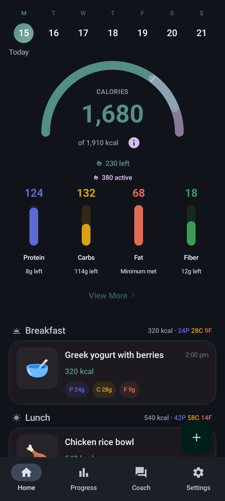
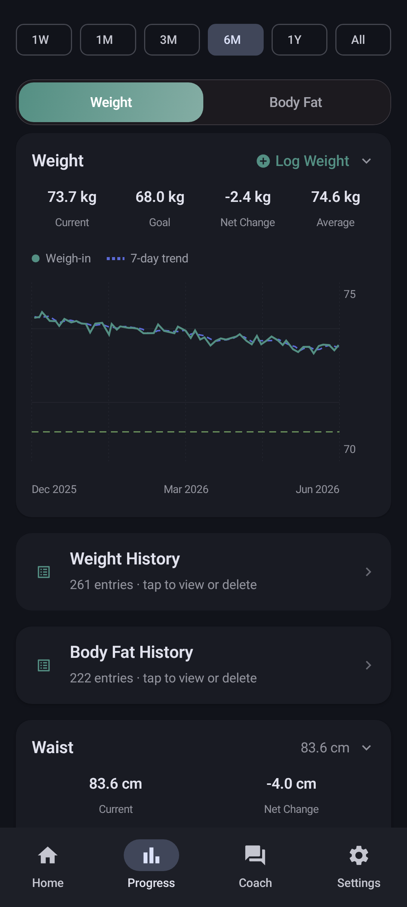
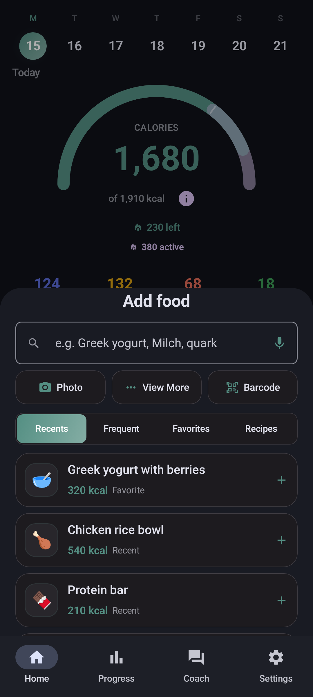
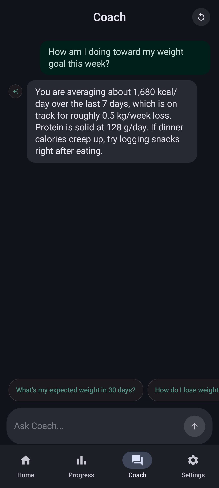
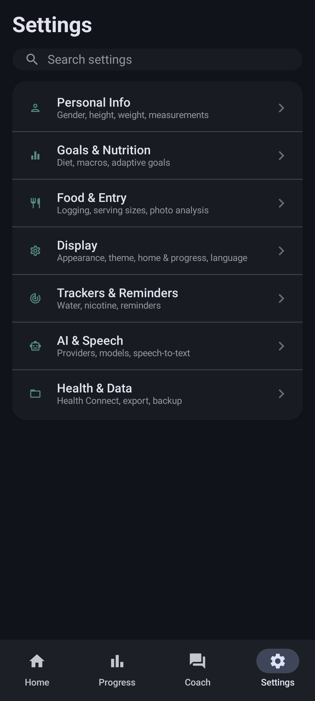

# NoFUD

**Ad-free AI calorie tracker for Android**, a privacy-focused fork of [Fud AI](https://github.com/apoorvdarshan/fud-ai).

Snap, speak, scan, share, or type your food with your own AI provider key. Same BYOK model as Fud AI: the app is free, you supply a provider key (a free [Google AI Studio](https://aistudio.google.com/apikey) key works for casual use). No account, no cloud sync. **No banner ads.**

> **Android only.** iOS is not supported yet.  
> **Project home:** [codeberg.org/fitguy/NoFUD](https://codeberg.org/fitguy/NoFUD)

## Get started

Not on Play Store or F-Droid yet. Install from one of these:

| Method | What to do |
|--------|------------|
| **Obtainium** *(recommended)* | Tap the banner above, then confirm in Obtainium |
| **Direct APK** | Download from [Codeberg Releases](https://codeberg.org/fitguy/nofud/releases) |
| **Manual Obtainium add** | Paste `https://codeberg.org/fitguy/nofud` into Obtainium's **Add App** screen |

> **Which APK?** Use `arm64-v8a` on most modern phones, `armeabi-v7a` on older 32-bit devices, and `x86_64` on emulators or Chromebooks. Use the universal APK only when unsure.

| Build | Package ID |
|-------|------------|
| Release | `org.codeberg.fitguy.nofud` |
| Debug (from source) | `org.codeberg.fitguy.nofud.debug` |

## Screenshots

Material 3 **dark theme** (light theme is also available). Images in [`docs/screenshots/`](docs/screenshots/) are regenerated during [`release:package`](RELEASE.md#release-screenshots-optional) when UI previews change.

<table>
  <tr>
    <td align="center">
       
      <b>Home</b>: calorie ring, macro bars, today's meal log
    </td>
    <td align="center">
       
      <b>Progress</b>: weight &amp; body-fat charts, steps &amp; exercise, goals
    </td>
    <td align="center">
       
      <b>Add food</b>: photo, share from gallery, voice, barcode, manual, saved meals
    </td>
  </tr>
  <tr>
    <td align="center">
       
      <b>Coach</b>: AI chat with your own provider key
    </td>
    <td align="center" colspan="2">
       
      <b>Settings</b>: profile, diet modes (incl. keto), Health Connect, themes
    </td>
  </tr>
</table>

## Features

Core Fud AI features, minus ads, plus fork-specific additions through v1.7.0:

| Feature | Details |
|---------|---------|
| **Food logging** | Camera, share from gallery/camera, voice, barcode, text, and manual entry via `AddFoodSheet`; draft recovery if logging is interrupted |
| **AI Coach** | Chat with your own provider key; replies follow the app language |
| **Diet modes** | Including keto carb mode (goals, meal advice, and Coach stay in sync) |
| **Progress** | Weight, body fat, calorie history, goals, and daily steps/exercise from Health Connect |
| **Workouts** | Built-in exercise library |
| **Health Connect** | Two-way sync; live import of meals logged by other apps |
| **Widgets** | Home-screen widgets |
| **Export & share** | Diary export (JSON / Markdown / CSV), meal sharing, bulk JSON import |
| **Localization** | 15 languages |

## Why NoFUD

NoFUD keeps the Fud AI core and removes monetization. Main fork changes:

- **No ads**: AdMob removed (Fud AI still shows banner ads)
- **Diet modes**: keto and other modes not in upstream Fud AI
- **Logging UX**: `AddFoodSheet`, share-into-app photos, draft recovery, camera/text/photo flow updates
- **Health ecosystem**: steps, exercise, and live meal import via Health Connect (Gadgetbridge, openScale, Samsung Health, etc.)
- **UI updates**: Material 3 theming, optional glass blur, nutrient display polish
- **Audited nutrition math**: documented formulas and unit tests ([`CALCULATION_METHODS.md`](CALCULATION_METHODS.md))
- **Smaller APK**: much smaller than upstream Fud AI (~45 MB vs 121 MB universal; see [releases](https://codeberg.org/fitguy/NoFUD/releases))
- **F-Droid-ready builds**: `play` and `fdroid` release flavors on Codeberg

See [CHANGELOG.md](CHANGELOG.md) for release notes.

## Health Connect

NoFUD uses **Android Health Connect**. No vendor SDKs, no accounts. Anything that syncs into Health Connect works with NoFUD, including FOSS bridges:

| Companion | What it brings | Notes |
|-----------|----------------|-------|
| [Gadgetbridge](https://gadgetbridge.org/) | Steps, exercise sessions, weight from wearables (Huawei, Honor, Amazfit, Mi Band, Pebble, …) | FOSS, on F-Droid; enable *Settings → External Integrations → Health Connect* |
| [openScale](https://f-droid.org/en/packages/com.health.openscale/) | Weight and body composition from Bluetooth scales | FOSS, on F-Droid |
| Samsung Health, Fitbit, Withings, … | Weight, activity, energy burn | Via each app's Health Connect sync |

**What syncs**

| Direction | Data |
|-----------|------|
| **In** | Weight and body fat (live), meals from other apps, steps and exercise (Progress tab), active/total energy burn (Energy Burn goal anchor) |
| **Out** | Every meal as a full `NutritionRecord` (macros + micronutrients), plus weight and body fat entries |

> **Huawei Health users:** pair your wearable with [Gadgetbridge](https://gadgetbridge.org/) instead of the Huawei Health app. Huawei Health Kit requires an HMS account and is not supported.

## Migrate from Fud AI

Two paths:

| Path | Steps |
|------|-------|
| **A: File export** | In Fud AI, export your food diary as JSON. In NoFUD, open **Settings → Import Food Diary JSON** (bulk import supported) |
| **B: Health Connect** | Enable Health Connect in both apps and grant read permissions to restore historical data |

**Before you switch**

1. Export a food diary JSON from Fud AI if you want a file backup.
2. Optionally sync your latest entries to Health Connect in Fud AI.

**What transfers**

- **Food log**: JSON import and/or Health Connect restore
- **Weight + body fat**: Health Connect import and ongoing sync

> **Limitation:** no dedicated weight/body-composition file import/export yet. Those metrics migrate through Health Connect.

### NoFUD vs Fud AI

| Area | Fud AI | NoFUD |
|------|--------|-------|
| Android AI calorie tracking | Yes | Yes |
| Banner ads (AdMob) | Yes | **Removed** |
| Bring your own API key | Yes | Yes |
| Analytics / tracking SDKs | None | None |
| Diet mode / keto carb mode | No | **Added** |
| Share photo into app | No | **Added** |
| Progress steps & exercise card | No | **Added** (Health Connect) |
| Live Health Connect meal import | No | **Added** |
| Bulk diary JSON import | No | **Added** |
| Add-entry flow | Baseline | **Enhanced** (`AddFoodSheet` + UX refinements) |
| APK size (`universal`) | 121.4 MB (`android-v3.0.4`) | **~45 MB** (`v1.7.0`) |
| UX / UI polish | Baseline | **Expanded** |
| F-Droid / play release flavors | N/A | **Both on Codeberg** |

Sources: [Fud AI releases](https://github.com/apoorvdarshan/fud-ai/releases), [NoFUD releases](https://codeberg.org/fitguy/NoFUD/releases)

## Performance

On our Android debug perf baseline, recent Progress-screen optimizations cut worst-frame latency from ~1.1s to ~0.5s and reduced jank in the captured navigation/render path. See [PERFORMANCE.md](PERFORMANCE.md).

## Privacy

No ads, analytics, or tracking SDKs. AI requests go to whichever provider you configure, same as Fud AI. See [PRIVACY.md](PRIVACY.md).

## Development

| Doc | Contents |
|-----|----------|
| [DEVELOPMENT.md](DEVELOPMENT.md) | Build from source (devenv / Gradle) |
| [RELEASE.md](RELEASE.md) | Maintainer release flow |
| [PERFORMANCE.md](PERFORMANCE.md) | Perf baseline and validation |
| [CALCULATION_METHODS.md](CALCULATION_METHODS.md) | Formula register and audit trail |

## Attribution & license

NoFUD is based on [Fud AI](https://github.com/apoorvdarshan/fud-ai).

- Copyright (c) 2026 Apoorv Darshan - [MIT License](LICENSE)
- Modifications Copyright (c) 2026 fitguy - MIT License

See also [NOTICE](NOTICE) and [ASSET_CREDITS.md](ASSET_CREDITS.md).

MIT License. See [LICENSE](LICENSE).
