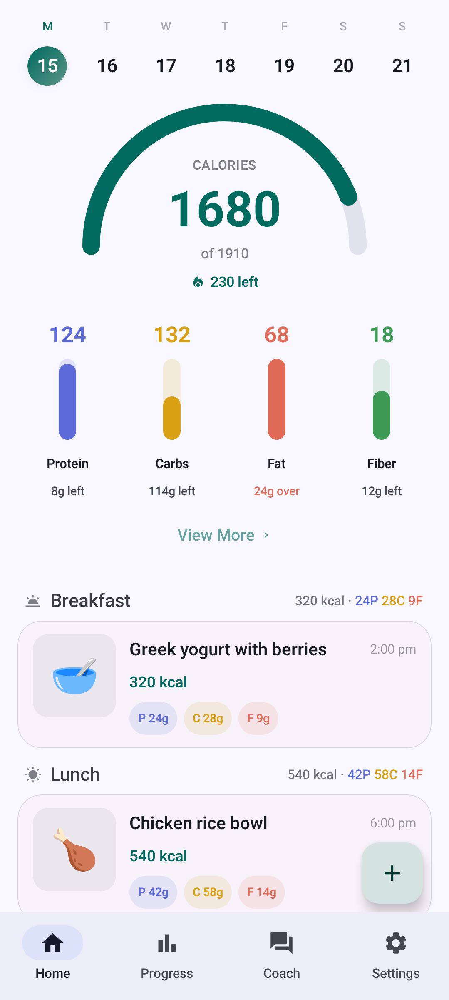

# NoFUD

**Ad-free AI calorie tracker for Android.** Cloud BYOK or opt-in on-device Gemma 4 inference. Privacy-focused fork of [Fud AI](https://github.com/apoorvdarshan/fud-ai). Lean app, open exports, Health Connect for scales and wearables.

**[Website](https://fitguy.codeberg.page/NoFUD/)** · **[Install](https://fitguy.codeberg.page/NoFUD/download/)** (Obtainium / APK) · **[Privacy](PRIVACY.md)**

[-9C27B0?style=flat-square)](#on-device-ai-private)

> **Android only.** iOS is not supported yet.  
> **Project home:** [codeberg.org/fitguy/NoFUD](https://codeberg.org/fitguy/NoFUD)  
> **Website:** [fitguy.codeberg.page/NoFUD](https://fitguy.codeberg.page/NoFUD/)

NoFUD started in July 2026 when upstream Fud AI [added banner ads (AdMob)](https://github.com/apoorvdarshan/fud-ai/releases). Upstream removed ads again in 3.0.3. This fork keeps its own roadmap: Android-first UX, smaller APK (no workout library or ad SDKs), snappier UI, open export/import, and [Health Connect](https://developer.android.com/health-and-fitness/guides/health-connect) for live data from scales, phones, and wearables.

Snap, speak, scan, share, or type your food with cloud AI (your own provider key) or opt-in on-device inference with Gemma 4 Edge models. Food text and photos stay on your phone.

**Cloud (BYOK):** same model as Fud AI: the app is free, you supply a provider key (a free [Google AI Studio](https://aistudio.google.com/apikey) key works for casual use). **On-Device (Private):** Settings → AI Provider → download Gemma 4 once (~2.4–3.4 GB); no API key, no server upload for food analysis. No account, no cloud sync. No banner ads in NoFUD.

## Get started

Not on the Play Store. F-Droid metadata is submitted; until the package appears in the F-Droid client, install from Obtainium or Codeberg Releases.

| Method | What to do |
|--------|------------|
| **Obtainium** *(recommended)* | Tap the banner above, then confirm in Obtainium |
| **Direct APK** | Download from [Codeberg Releases](https://codeberg.org/fitguy/nofud/releases) |
| **Manual Obtainium add** | Paste `https://codeberg.org/fitguy/nofud` into Obtainium's **Add App** screen |
| **F-Droid** | Package `org.codeberg.fitguy.nofud` — [expected listing](https://f-droid.org/packages/org.codeberg.fitguy.nofud/) once indexed |

> **Which APK?** Use `arm64-v8a` on most modern phones, `armeabi-v7a` on older 32-bit devices, and `x86_64` on emulators or Chromebooks. Use the universal APK only when unsure.

| Build | Package ID |
|-------|------------|
| Release | `org.codeberg.fitguy.nofud` |
| Debug (from source) | `org.codeberg.fitguy.nofud.debug` |

## Screenshots

Material 3 **dark theme** (light theme is also available). Images in [`docs/screenshots/`](docs/screenshots/) are updated when release screenshots are regenerated.

<table>
  <tr>
    <td align="center">
       
      <b>Home</b>: calorie ring, macro bars, today's meal log
    </td>
    <td align="center">
       
      <b>Home (light)</b>: same dashboard in light theme
    </td>
    <td align="center">
       
      <b>Progress</b>: weight &amp; body-fat charts, steps &amp; exercise, goals
    </td>
    <td align="center">
       
      <b>Add food</b>: photo, note, saved meals; voice, barcode; cloud or on-device AI
    </td>
  </tr>
  <tr>
    <td align="center">
       
      <b>Coach</b>: AI chat with your own provider key
    </td>
    <td align="center" colspan="2">
       
      <b>Settings</b>: profile, diet modes (incl. keto), Health Connect, themes
    </td>
  </tr>
</table>

## Features

Android-optimized calorie and macro tracking. Core Fud AI logging plus fork-specific additions:

| Feature | Details |
|---------|---------|
| **Food logging** | Multi-photo capture (up to 10), share into app, voice, barcode, text, manual entry, saved meals; draft recovery if analysis is interrupted |
| **On-device AI (opt-in)** | **On-Device (Private)** in Settings → AI Provider: Gemma 4 E2B or E4B runs food text and photo analysis locally via [LiteRT-LM](https://developers.google.com/edge/litert-lm/android); one-time model download (~2.4–3.4 GB). Less accurate than cloud AI; optional fallback provider retries in the cloud |
| **AI Coach** | Chat with your own provider key; optional fallback provider; replies follow the app language |
| **Diet modes** | Including keto carb mode (goals, meal advice, and Coach stay in sync) |
| **Progress** | Weight, body fat, calorie history, goals, steps/exercise, and wellness (sleep, HR, hydration) from Health Connect |
| **Water tracking** | Optional local water log with home shortcuts, configurable quick-log presets, reminders, and widget (off by default) |
| **Health Connect** | Two-way sync; live import of meals from other apps; manage access from Settings; optional background sync |
| **Widgets** | Calorie, protein, all-metrics, and water home-screen widgets |
| **Export & share** | Diary export (JSON / Markdown / CSV), weight & body-metrics import/export, meal sharing, bulk JSON import |
| **Localization** | 15 languages |

## Why NoFUD

**Origin.** Fud AI briefly shipped AdMob banners. NoFUD forked the same week to stay ad-free on [Codeberg](https://codeberg.org/fitguy/NoFUD). Upstream dropped ads again later. NoFUD does not chase upstream feature-for-feature; it stays a focused Android food tracker.

**Priorities**

- **Privacy:** no ads, no analytics SDKs, local-first storage, BYOK cloud AI or opt-in on-device Gemma 4 inference ([PRIVACY.md](PRIVACY.md))
- **FOSS barcode:** on-device scanning via [zxing-cpp](https://github.com/zxing-cpp/zxing-cpp) (Apache-2.0), not proprietary ML Kit.
- **Open data:** export diary and body metrics; import JSON, CSV, openScale, Health Connect; `nofud://` meal share links
- **Wearables:** Health Connect in/out for steps, exercise, weight, meals, sleep, hydration, energy burn (Gadgetbridge, openScale, Samsung Health, etc.)
- **Lean scope:** no workouts tab or bundled exercise library; F-Droid / Codeberg APKs (Google Play flavor disabled; see [`docs/DISTRIBUTION.md`](docs/DISTRIBUTION.md))

**UX, size, speed**

- **APK:** ~15 MiB arm64 / ~27 MiB universal (v1.14.9) vs ~120 MB upstream with workouts ([releases](https://codeberg.org/fitguy/NoFUD/releases))
- **Responsiveness:** monthly diary buckets, off-main-thread thumbnails, phased AI progress UI
- **UI:** Material 3, `AddFoodSheet`, customizable home nutrients and meal times, macro remaining/over, multi-photo flow
- **Extras:** keto/diet modes, fallback AI provider, audited nutrition math

See [CHANGELOG.md](CHANGELOG.md) for release notes.

## On-device AI (private)

**Settings → AI Provider → On-Device (Private)** runs food logging AI on your phone. No API key, no account, and nothing sent to a cloud provider for text or photo analysis.

| | |
|---|---|
| **Models** | [Gemma 4 Edge](https://developers.google.com/edge/litert-lm/android) (E2B ~2.4 GB or E4B ~3.4 GB), downloaded once from Hugging Face |
| **What stays local** | Food text and photo analysis when logging meals |
| **Requirements** | arm64 or x86_64, 6 GB+ RAM (hidden on unsupported devices) |
| **Accuracy** | On-device models are much smaller than cloud AI (Gemini, GPT, Claude, etc.) and often misread portions, brands, and photos. Cloud AI remains the recommended default |
| **Fallback** | Enable **Fallback Provider** so a cloud model retries when on-device inference fails |

Coach chat still requires a cloud provider. New in [v1.14.0](CHANGELOG.md#1140---2026-07-15).

## Health Connect

NoFUD uses **Android Health Connect**. No vendor SDKs, no accounts. Anything that syncs into Health Connect works with NoFUD, including FOSS bridges:

| Companion | What it brings | Notes |
|-----------|----------------|-------|
| [Gadgetbridge](https://gadgetbridge.org/) | Steps, exercise sessions, weight from wearables (Huawei, Honor, Amazfit, Mi Band, Pebble, …) | FOSS, on F-Droid; enable *Settings → External Integrations → Health Connect* |
| [openScale](https://f-droid.org/en/packages/com.health.openscale/) | Weight and body composition from Bluetooth scales | FOSS, on F-Droid |
| Samsung Health, Fitbit, Withings, … | Weight, activity, energy burn | Via each app's Health Connect sync |

**What syncs**

| Direction | Data |
|-----------|------|
| **In** | Weight and body fat (live), meals from other apps, steps and exercise (Progress tab), sleep / resting heart rate / hydration (Wellness card), active/total energy burn (Energy Burn goal anchor) |
| **Out** | Every meal as a full `NutritionRecord` (macros + micronutrients), plus weight, body fat and height entries |

Optionally, **background sync** (Settings → Health &amp; Data, off by default) checks Health Connect for new data every few hours even when NoFUD is closed.

> **Huawei Health users:** pair your wearable with [Gadgetbridge](https://gadgetbridge.org/) instead of the Huawei Health app. Huawei Health Kit requires an HMS account and is not supported.

## Migrate from Fud AI

Two paths:

| Path | Steps |
|------|-------|
| **A: File export** | In Fud AI, export your food diary as JSON. In NoFUD, open **Settings → Import Food Diary JSON** (bulk import supported) |
| **B: Health Connect** | Enable Health Connect in both apps and grant read permissions to restore historical data |

**Before you switch**

1. Export a food diary JSON from Fud AI if you want a file backup.
2. Optionally sync your latest entries to Health Connect in Fud AI.

**What transfers**

- **Food log**: JSON import and/or Health Connect restore
- **Weight + body fat + measurements**: file import/export (CSV or JSON) **or** Health Connect import and ongoing sync

Weight and body data now import from a file too: **Settings → Import Weight & Body Data** accepts NoFUD's own JSON/CSV export, [openScale](https://f-droid.org/en/packages/com.health.openscale/) CSV, and generic weight CSVs (MyFitnessPal / SparkyFitness style, kg or lb). Body-circumference sites (waist, neck, etc.) have no Health Connect record type, so file transfer is the way to move those between installs.

### NoFUD vs Fud AI

| Area | Fud AI (upstream) | NoFUD |
|------|-------------------|-------|
| Android AI calorie tracking | Yes | Yes |
| Banner ads (AdMob) | Added Jul 2026, removed in 3.0.3 | **Never shipped** |
| Bring your own API key | Yes | Yes |
| On-device private AI (Gemma 4 Edge) | No | **Yes** (opt-in, v1.14.0) |
| Barcode on-device scanner | Proprietary ML Kit | **FOSS zxing-cpp** (Apache-2.0) |
| Analytics / tracking SDKs | None | None |
| Workouts tab + exercise library | Yes (~873 exercises, large APK) | **Omitted** (food tracking focus) |
| Diet mode / keto carb mode | No | **Yes** |
| Share photo into app | No | **Yes** |
| Multi-photo meal capture | Up to 10 (3.1+) | **Yes** |
| Water tracking (local) | Yes (3.1+) | **Yes** |
| Custom meal time boundaries | Yes (3.1+) | **Yes** |
| Progress steps, exercise, wellness | Partial | **Yes** (Health Connect) |
| Live Health Connect meal import | Yes | **Yes** |
| Bulk diary / body-metrics import | Limited | **Yes** (JSON, CSV, openScale) |
| Fallback AI provider | No | **Yes** |
| APK size (approx.) | ~120 MB universal (with workouts) | **~15 MiB arm64 / ~27 MiB universal** (v1.14.8) |
| UX / UI polish | Baseline | **Android-optimized** (`AddFoodSheet`, widgets, themes) |
| F-Droid / direct APK releases | Play-focused | **Codeberg** |

Sources: [Fud AI releases](https://github.com/apoorvdarshan/fud-ai/releases), [NoFUD releases](https://codeberg.org/fitguy/NoFUD/releases)

## Performance

We are focused on a fast Android app rather than matching upstream feature:

- **Install size:** no workouts bundle or ad SDK; arm64 APK ~15 MiB, universal ~27 MiB (v1.14.8)
- **Food log I/O:** monthly diary buckets for large histories
- **UI:** off-main-thread entry thumbnails; Progress screen frame-time improvements in our perf baseline
- **AI uploads:** image downscaling before provider requests

On our Android debug perf baseline, recent Progress-screen work cut worst-frame latency from ~1.1s to ~0.5s.

## Docs

Maintainer guides live under [`docs/`](docs/) — [development](docs/DEVELOPMENT.md), [releasing](docs/RELEASE.md), [performance](docs/PERFORMANCE.md), [calculations](docs/CALCULATION_METHODS.md), [asset credits](docs/ASSET_CREDITS.md), and more. Privacy and changelog stay at the repo root.

## Privacy

No ads, analytics, or tracking SDKs. Food logs, body metrics, and Coach chat stay on-device unless you export them or sync through Health Connect. Cloud AI requests go to the provider you configure (BYOK). **On-Device (Private)** keeps food text and photo analysis on the device; nothing is uploaded to a server. See [PRIVACY.md](PRIVACY.md).

## Attribution & license

NoFUD is based on [Fud AI](https://github.com/apoorvdarshan/fud-ai).

- Copyright (c) 2026 Apoorv Darshan - [MIT License](LICENSE)
- Modifications Copyright (c) 2026 fitguy - MIT License

See also [NOTICE](NOTICE) and [ASSET_CREDITS.md](docs/ASSET_CREDITS.md).

MIT License. See [LICENSE](LICENSE).
