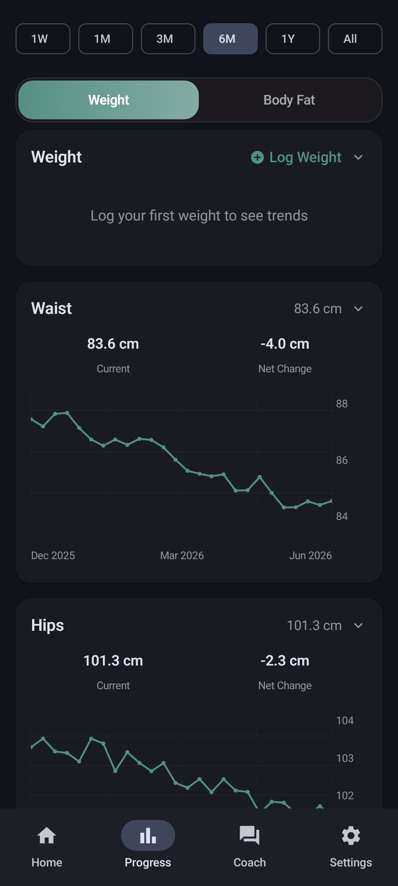

# Chompass

**Private calorie tracking for Android and the browser**

Bring your own AI key. On Android you can also run Gemma 4 on-device. No ads, no analytics, no account.

[Website](https://chompass.app/) · [Download](https://chompass.app/download/) · [Web app](https://chompass.app/app/) · [Privacy](docs/PRIVACY.md)

Log food with a photo, voice, barcode, or typed note. Barcode scans look up [Open Food Facts](https://world.openfoodfacts.org/) (4.6M+ products, cached offline). Photo analysis can also read codes from the image. The [PWA](https://chompass.app/app/) and the Android app share the same diary and body-metrics JSON. There is no cloud sync between clients.

## Install

### Web app (PWA)

Open [chompass.app/app/](https://chompass.app/app/) in any modern browser (phone, tablet, or desktop). You can install it to the home screen or dock. Diary, progress, AI entry and Coach with your own key, and shared JSON export/import with the Android app.

Works in Firefox, Safari, and other engines. **Chromium-based browsers** (Chrome, Edge, Brave, Cromite) generally have the smoothest install prompt, camera barcode, and Web Speech support.

Step-by-step install: [Download → How to install](https://chompass.app/download/#how-to-install). Inside the PWA: **Settings → Install app**.

### Android app

Not on the Play Store. Install from **F-Droid**, Obtainium, or Codeberg Releases.

&nbsp;&nbsp;&nbsp;&nbsp;

- **F-Droid**: [app.chompass](https://f-droid.org/packages/app.chompass/). Install and auto-update from the F-Droid client.
- **Obtainium**: tap the badge above, then confirm. Or paste `https://codeberg.org/fitguy/chompass` into **Add App**.
- **Direct APK**: [Codeberg Releases](https://codeberg.org/fitguy/chompass/releases). The release APK covers 64-bit and 32-bit ARM phones. It does not include Intel (x86) libraries.

Release package ID: `app.chompass`. Debug (from source): `app.chompass.debug`.

## Screenshots

Material 3 dark theme (light theme also available). Images are in [`docs/screenshots/`](docs/screenshots/).

<table>
  <tr>
    <td align="center" width="33%">
       
      <b>Home</b>: calorie ring, macros, meals
    </td>
    <td align="center" width="33%">
       
      <b>Add food</b>: photo, voice, barcode, AI
    </td>
    <td align="center" width="33%">
       
      <b>Meal components</b>: edit ingredients and grams
    </td>
  </tr>
  <tr>
    <td align="center" width="33%">
       
      <b>Recipes</b>: multi-ingredient saved meals
    </td>
    <td align="center" width="33%">
       
      <b>AI analysis</b>: progress steps and streaming fields
    </td>
    <td align="center" width="33%">
       
      <b>Progress</b>: weight, steps, goals
    </td>
  </tr>
  <tr>
    <td align="center" width="33%">
       
      <b>Progress plots</b>: optional per-site body measurement trends
    </td>
    <td align="center" width="33%">
       
      <b>Coach</b>: chat with your own key
    </td>
    <td align="center" width="33%">
       
      <b>Settings</b>: providers, goals, data
    </td>
  </tr>
</table>

## Features

On both the [PWA](https://chompass.app/app/) and the Android app unless noted:

- **Food logging**: photo (up to 10), voice, barcode, text, manual entry, meal components, recipes, saved meals, draft recovery. Android also accepts a share into the app.
- **Barcode**: [Open Food Facts](https://world.openfoodfacts.org/) lookup (4.6M+ products, cached offline). Reads EAN, QR, and Data Matrix. FOSS [zxing-cpp](https://github.com/zxing-cpp/zxing-cpp) on Android; browser scanner on the PWA.
- **Food search** (Android): live Open Food Facts search plus offline USDA and Swiss Food Composition indexes.
- **AI**: your own cloud key (a free [Google AI Studio](https://aistudio.google.com/apikey) key is enough for casual use). Progress steps and a live field preview. Coach chat on both clients. You can turn all AI features off; barcode, search, and manual logging stay on.
- **On-device AI** (Android): optional **On-Device (Private)** Gemma 4. See below.
- **Progress**: weight, body fat, measurements, forecast. Keto and other diet modes. Water tracking.
- **Export and sync**: diary export (JSON / Markdown / CSV), weight and body-metrics import/export, bulk JSON import, meal share links. Optional user-hosted **WebDAV** sync (your server; no Chompass backend).
- **Languages**: 18. The PWA covers core screens.

Android only:

- **Live calorie budget**: in Add Active mode the home ring grows the daily goal with the day's burn (Health Connect, a manual entry, or an estimate from your history). Widgets use the same budget.
- **Health Connect**: steps, exercise, sleep, heart rate, hydration. Two-way with Gadgetbridge, openScale, and other Health Connect apps.
- **Widgets and notifications**
- **Size**: ~17 MiB arm64 / ~29 MiB universal. No ads, analytics, or workout library.

## On-device AI

On Android, open **Settings → AI & Speech** and choose **On-Device (Private)**. Food logging AI then runs on the phone. No API key, and nothing is sent to a cloud provider for text or photo analysis.

|                      |                                                                                                                                       |
| -------------------- | ------------------------------------------------------------------------------------------------------------------------------------- |
| **Models**           | [Gemma 4 Edge](https://developers.google.com/edge/litert-lm/android) (E2B ~2.4 GB or E4B ~3.4 GB), downloaded once from Hugging Face  |
| **What stays local** | Food text and photo analysis                                                                                                          |
| **Requirements**     | arm64, 6 GB+ RAM (hidden on unsupported devices)                                                                                      |
| **Accuracy**         | On-device models are much smaller than cloud AI and often misread portions, brands, and photos. Cloud AI is the better default.       |
| **Fallback**         | Enable **Fallback Provider** so a cloud model retries when on-device inference fails                                                  |

Coach chat still needs a cloud provider.

## Health Connect

Android. No vendor SDKs and no extra account. Apps that write to Health Connect can feed Chompass:

| Companion                                                          | What it brings                                    | Notes                                                            |
| ------------------------------------------------------------------ | ------------------------------------------------- | ---------------------------------------------------------------- |
| [Gadgetbridge](https://gadgetbridge.org/)                          | Steps, exercise, weight from wearables            | FOSS; enable _Settings → External Integrations → Health Connect_ |
| [openScale](https://f-droid.org/en/packages/com.health.openscale/) | Weight and body composition from Bluetooth scales | FOSS, on F-Droid                                                 |
| Samsung Health, Fitbit, Withings, etc.                             | Weight, activity, energy burn                     | Via each app's Health Connect sync                               |

| Direction | Data                                                                                         |
| --------- | -------------------------------------------------------------------------------------------- |
| **In**    | Weight and body fat, meals from other apps, steps and exercise, sleep, resting HR, hydration, energy burn |
| **Out**   | Every meal, plus weight, body fat, and height                                                |

Optional **background sync** (Settings → Health & Data, off by default) reads Health Connect every few hours while the app is closed, on devices that support it.

On Android 14 and later, Health Connect is a system module. Some de-Googled builds show it in Settings but apps cannot use it. Use file export/import or WebDAV in that case. Huawei Health Kit is not supported; pair the wearable with [Gadgetbridge](https://gadgetbridge.org/) instead.

## How accurate is the AI?

Accuracy depends on the model you pick. The app does not claim a single number. We benchmark against labeled datasets and publish the results.

Typed entry with a stated portion: **5.7% WMAPE, 90% within ±20%** of true calories. Photo estimation is hard for every vision model we tested (best paid model: **32.3% WMAPE, 50% within ±20%**). Full numbers: [`docs/ACCURACY.md`](docs/ACCURACY.md).

## Migrate from Fud AI

Chompass is based on [Fud AI](https://github.com/apoorvdarshan/fud-ai). Diary JSON from Fud AI imports here.

| Path                  | Steps                                                                                                  |
| --------------------- | ------------------------------------------------------------------------------------------------------ |
| **File export**       | In Fud AI, export your food diary as JSON. In Chompass, open **Settings → Import Food Diary JSON**     |
| **Health Connect**    | Enable Health Connect in both apps and grant read permissions (Android)                                |

**Settings → Import Weight & Body Data** also accepts Chompass JSON/CSV, [openScale](https://f-droid.org/en/packages/com.health.openscale/) CSV, and common weight CSVs. Body-circumference sites have no Health Connect record type, so use file transfer for those.

| Feature                 | [Fud AI](https://github.com/apoorvdarshan/fud-ai) | Chompass Android                          | [Chompass PWA](https://chompass.app/app/) |
| ----------------------- | ------------------------------------------------- | ----------------------------------------- | ----------------------------------------- |
| Banner ads              | Brief AdMob; removed in 3.0.3                     | **Never shipped**                         | **Never shipped**                         |
| On-device AI (Gemma 4)  | No                                                | **Yes** (opt-in)                          | No (cloud, your key)                      |
| Barcode                 | ML Kit                                            | **FOSS zxing-cpp**                        | Browser / OFF                             |
| Workouts library        | Yes (~120 MB APK)                                 | **Omitted** (~17 MiB arm64)               | Omitted                                   |
| Keto / diet modes       | No                                                | **Yes**                                   | **Yes**                                   |
| Health Connect          | Partial                                           | **Steps, exercise, sleep, HR, hydration** | No                                        |
| Widgets / notifications | Upstream set                                      | **Yes**                                   | No (installable PWA)                      |
| Languages               | Upstream                                          | **18**                                    | **18** (core screens)                     |
| Distribution            | Play-focused                                      | **F-Droid** / Obtainium / Codeberg        | **PWA**                                   |
| Open diary / body JSON  | Upstream formats                                  | **Yes**                                   | **Same contracts as Android**             |

Sources: [Fud AI releases](https://github.com/apoorvdarshan/fud-ai/releases), [Chompass releases](https://codeberg.org/fitguy/chompass/releases). Maintainer matrix: [`docs/PARITY.md`](docs/PARITY.md). Release notes: [`docs/CHANGELOG.md`](docs/CHANGELOG.md).

## Privacy

No ads, analytics, or tracking SDKs. Food logs, body metrics, and Coach chat stay on the device unless you export them, sync through Health Connect, or use WebDAV. Cloud AI requests go only to the provider you configure. API keys are encrypted at rest and are not sent to a Chompass server. **On-Device (Private)** keeps food analysis on the phone.

Full policy: [PRIVACY.md](docs/PRIVACY.md). Docs index: [`docs/README.md`](docs/README.md). Building from source: [`CONTRIBUTING.md`](CONTRIBUTING.md).

## Support

Chompass is free, ad-free, and open source. If you'd like to say thanks, you can [buy fitguy a yogurt](https://ko-fi.com/fitguy) on Ko-fi.

## Attribution & license

Chompass is based on [Fud AI](https://github.com/apoorvdarshan/fud-ai).

- Copyright (c) 2026 Apoorv Darshan - [MIT License](LICENSE)
- Modifications Copyright (c) 2026 fitguy - MIT License

See also [NOTICE](docs/NOTICE.md) and [ASSET_CREDITS.md](docs/ASSET_CREDITS.md).
