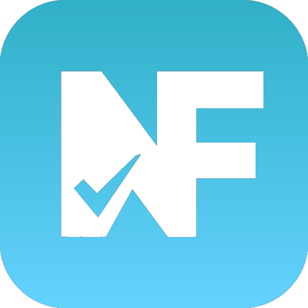
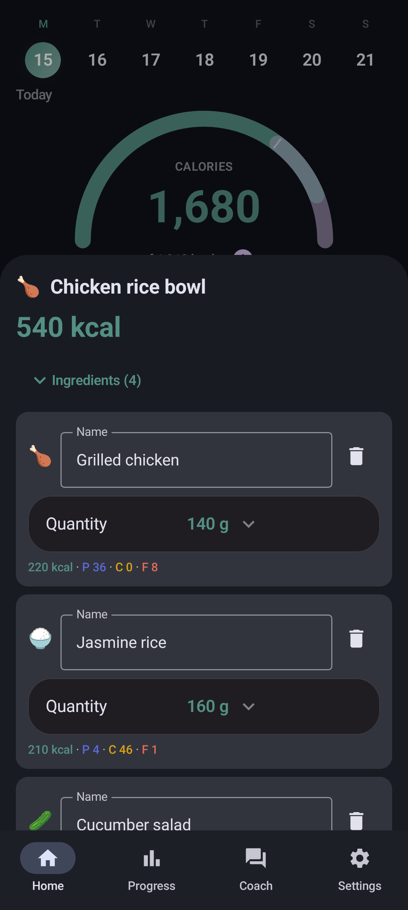
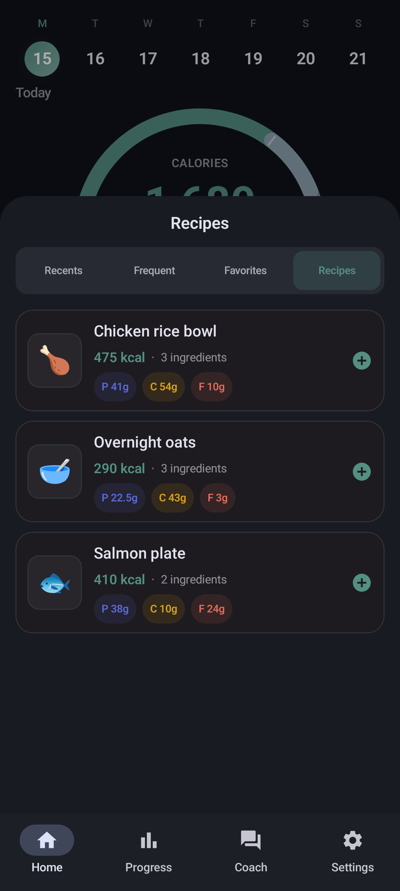
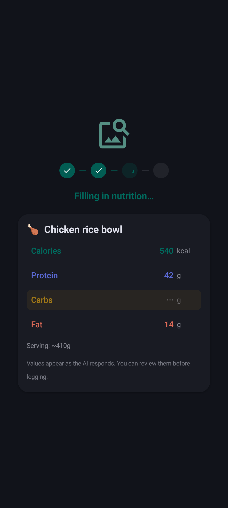

# Chompass

**Private calorie tracking for Android and the browser**

Bring your own AI key on either client. On the Android app you can also run Gemma 4 on-device. No ads, no analytics. Based on [Fud AI](https://github.com/apoorvdarshan/fud-ai).

[Website](https://chompass.app/) · [Download](https://chompass.app/download/) · [Web app](https://chompass.app/app/) · [Privacy](docs/PRIVACY.md)

Log food with a photo, voice, barcode, share intent, or typed note. Barcode scans resolve against [Open Food Facts](https://world.openfoodfacts.org/) (4.6M+ products, cached for offline use), and photo analysis can read codes from the image. Use your own cloud AI key, or download Gemma 4 once for on-device analysis in the Android app. No ads, no account, no analytics. Open diary and body-metrics exports on both clients; [Health Connect](https://developer.android.com/health-and-fitness/guides/health-connect) for scales and wearables in the Android app.

Use the [installable PWA](https://chompass.app/app/) in any modern browser (Chromium-based browsers work best for install, camera barcode, and speech) or the Android APK. Both use the same diary and body-metrics JSON contracts; there is no cloud sync between clients. Health Connect, widgets, notifications, on-device AI, and full i18n are Android-app features. On Android, the home ring runs a live calorie budget: with Add Active mode your goal grows with the day's burn, measured by Health Connect, added manually, or estimated from your history. Project home: [codeberg.org/fitguy/chompass](https://codeberg.org/fitguy/chompass).

## Install

### Web app (PWA)

Open [chompass.app/app/](https://chompass.app/app/) in any modern browser (phone, tablet, or desktop). It is a progressive web app you can install to the home screen or dock. Diary logging, progress, AI entry and Coach with your own key, and shared JSON export/import with the Android app.

Works in Firefox, Safari, and other engines; **Chromium-based browsers** (Chrome, Edge, Brave, Cromite, etc.) generally have the smoothest install prompt, camera barcode, and Web Speech support.

Step-by-step install for iOS, Android, and desktop browsers: [Download → How to install](https://chompass.app/download/#how-to-install) (also **Settings → Install app** inside the PWA).

### Android app

Not on the Play Store. Install from **F-Droid**, Obtainium, or Codeberg Releases.

&nbsp;&nbsp;&nbsp;&nbsp;

- **F-Droid**: [app.chompass](https://f-droid.org/packages/app.chompass/) — install and auto-update from the F-Droid client.
- **Obtainium**: tap the badge above, then confirm in Obtainium. Or paste `https://codeberg.org/fitguy/chompass` into **Add App**.
- **Direct APK**: download from [Codeberg Releases](https://codeberg.org/fitguy/chompass/releases). Prefer `arm64-v8a` on modern phones; use `armeabi-v7a` for older 32-bit devices, `x86_64` for emulators/Chromebooks, or universal only when unsure.

Release package ID: `app.chompass`. Debug (from source): `app.chompass.debug`.

## Screenshots

Material 3 dark theme (light theme also available). Images are in [`docs/screenshots/`](docs/screenshots/).

<table>
  <tr>
    <td align="center" width="33%">
       
      <b>Home</b>: calorie ring, macros, meals
    </td>
    <td align="center" width="33%">
       
      <b>Add food</b>: photo, voice, barcode, AI
    </td>
    <td align="center" width="33%">
       
      <b>Meal components</b>: edit ingredients and grams
    </td>
  </tr>
  <tr>
    <td align="center" width="33%">
       
      <b>Recipes</b>: multi-ingredient saved meals
    </td>
    <td align="center" width="33%">
       
      <b>AI analysis</b>: progress steps and streaming fields
    </td>
    <td align="center" width="33%">
       
      <b>Progress</b>: weight, steps, goals
    </td>
  </tr>
</table>

## Features

Shared on the [PWA](https://chompass.app/app/) and Android app unless noted:

- **Food logging**: multi-photo (up to 10), share into the app (Android), voice, barcode (FOSS [zxing-cpp](https://github.com/zxing-cpp/zxing-cpp) on Android with cached [Open Food Facts](https://world.openfoodfacts.org/) lookup of 4.6M+ products; browser / Open Food Facts on web), text, manual entry, editable meal components, recipes and saved meals, draft recovery
- **AI**: cloud, using your own key (a free [Google AI Studio](https://aistudio.google.com/apikey) key is enough for casual use) with progress steps and a live field preview. On Android: opt-in **On-Device (Private)** Gemma 4 via [LiteRT-LM](https://developers.google.com/edge/litert-lm/android), optional fallback provider. AI Coach chat on both clients.
- **Live calorie budget** (Android): the home ring grows your daily goal with the day's burn in Add Active mode, from measured Health Connect energy, a manual burn entry after a run you did not log with a device, or an estimate. Without live data it falls back to your 14-day active average from Health Connect history, then to your activity-level estimate. The ring compares today's burn with a typical day; widgets use the same budget.
- **Progress**: weight, body fat, measurements, forecast. **Health Connect** (Android): steps, exercise, wellness; two-way sync with Gadgetbridge, openScale, and other Health Connect apps
- **Diet & extras**: keto and other diet modes, water tracking. Android: home-screen widgets, 15 languages (web is EN-first)
- **Open data**: diary export (JSON / Markdown / CSV), weight and body-metrics import/export, bulk JSON import, meal share links (`chompass://` on Android; hash URL on web)
- **Size (Android)**: ~15 MiB arm64 / ~27 MiB universal; no ads, analytics, or workout library ([releases](https://codeberg.org/fitguy/chompass/releases))

## Why Chompass

Chompass is based on [Fud AI](https://github.com/apoorvdarshan/fud-ai) (forked in July 2026 when upstream briefly shipped AdMob banners, later removed in 3.0.3). Chompass stays ad-free, ships an Android app and a browser PWA, keeps a smaller APK, and adds meal components, recipes, clear analysis feedback, open export/import, and Health Connect. It does not try to match upstream feature for feature.

Priorities: privacy ([PRIVACY.md](docs/PRIVACY.md)), FOSS barcode scanning, open data, wearables via Health Connect, lean F-Droid / Codeberg distribution (Play flavor disabled; see [`docs/DISTRIBUTION.md`](docs/DISTRIBUTION.md)), and a data-compatible [PWA](https://chompass.app/app/) for any modern browser.

See [CHANGELOG.md](docs/CHANGELOG.md) for release notes.

## On-device AI (private)

**Android app.** **Settings → AI Provider → On-Device (Private)** runs food logging AI on your phone. No API key, no account, and nothing sent to a cloud provider for text or photo analysis.

|                      |                                                                                                                                       |
| -------------------- | ------------------------------------------------------------------------------------------------------------------------------------- |
| **Models**           | [Gemma 4 Edge](https://developers.google.com/edge/litert-lm/android) (E2B ~2.4 GB or E4B ~3.4 GB), downloaded once from Hugging Face  |
| **What stays local** | Food text and photo analysis when logging meals                                                                                       |
| **Requirements**     | arm64 or x86_64, 6 GB+ RAM (hidden on unsupported devices)                                                                            |
| **Accuracy**         | On-device models are much smaller than cloud AI and often misread portions, brands, and photos. Cloud AI is still the better default. |
| **Fallback**         | Enable **Fallback Provider** so a cloud model retries when on-device inference fails                                                  |

Coach chat still needs a cloud provider. Added in [v1.14.0](docs/CHANGELOG.md#1140---2026-07-15).

## Health Connect

**Android app.** Chompass uses **Android Health Connect** via Jetpack `connect-client`. No vendor SDKs, no accounts. Anything that syncs into Health Connect works with Chompass:

| Companion                                                          | What it brings                                    | Notes                                                            |
| ------------------------------------------------------------------ | ------------------------------------------------- | ---------------------------------------------------------------- |
| [Gadgetbridge](https://gadgetbridge.org/)                          | Steps, exercise, weight from wearables            | FOSS; enable _Settings → External Integrations → Health Connect_ |
| [openScale](https://f-droid.org/en/packages/com.health.openscale/) | Weight and body composition from Bluetooth scales | FOSS, on F-Droid                                                 |
| Samsung Health, Fitbit, Withings, etc.                             | Weight, activity, energy burn                     | Via each app's Health Connect sync                               |

| Direction | Data                                                                                                                            |
| --------- | ------------------------------------------------------------------------------------------------------------------------------- |
| **In**    | Weight and body fat (live), meals from other apps, steps and exercise, sleep / resting HR / hydration, active/total energy burn |
| **Out**   | Every meal as a full `NutritionRecord`, plus weight, body fat, and height                                                       |

Optional **background sync** (Settings → Health & Data, off by default) checks Health Connect every few hours when Chompass is closed. It is shown only when the device’s Health Connect module supports background reads, and it requests that permission when you enable it. History read (data older than ~30 days) is requested on connect when the module supports it.

### How Health Connect is delivered

| Android          | Provider                                                         | What Chompass tells you if unavailable                                               |
| ---------------- | ---------------------------------------------------------------- | ------------------------------------------------------------------------------------ |
| **13 and lower** | Standalone Play Store APK (`com.google.android.apps.healthdata`) | Install / update from the Play Store                                                 |
| **14 and later** | System / Mainline module (`HEALTHCONNECT_SERVICE`)               | Not available / needs a **system** update. **Never** "install the Play Store HC app" |

Chompass does **not** require sandboxed Play or Google Play Services in its own code. On Android 14+, Jetpack uses the platform binder when the ROM registers it. Some de-Googled builds (including GrapheneOS without Play) may show Health Connect in Settings while apps still see `SDK_UNAVAILABLE`; use **file export/import** or optional WebDAV instead. Chompass cannot reimplement the system Health Connect bus.

Newer capabilities (background read, history read, and later types) are gated with Jetpack `HealthConnectFeatures` / Mainline updates, not only by OS API level.

> **Huawei Health users:** pair your wearable with [Gadgetbridge](https://gadgetbridge.org/) instead. Huawei Health Kit requires an HMS account and is not supported.

## Migrate from Fud AI

| Path                  | Steps                                                                                                               |
| --------------------- | ------------------------------------------------------------------------------------------------------------------- |
| **A: File export**    | In Fud AI, export your food diary as JSON. In Chompass (Android or web), open **Settings → Import Food Diary JSON** |
| **B: Health Connect** | Enable Health Connect in both apps and grant read permissions (Android)                                             |

**Settings → Import Weight & Body Data** also accepts Chompass JSON/CSV, [openScale](https://f-droid.org/en/packages/com.health.openscale/) CSV, and common weight CSVs. Body-circumference sites have no Health Connect record type, so use file transfer for those.

### Fud AI vs Chompass Android vs Chompass PWA

| Feature                 | [Fud AI](https://github.com/apoorvdarshan/fud-ai) | Chompass Android                          | [Chompass PWA](https://chompass.app/app/) |
| ----------------------- | ------------------------------------------------- | ----------------------------------------- | ----------------------------------------- |
| Banner ads              | Brief AdMob; removed in 3.0.3                     | **Never shipped**                         | **Never shipped**                         |
| On-device AI (Gemma 4)  | No                                                | **Yes** (opt-in)                          | No (cloud, your key)                     |
| Barcode                 | ML Kit                                            | **FOSS zxing-cpp**                        | Browser / OFF                             |
| Workouts library        | Yes (~120 MB APK)                                 | **Omitted** (~15 MiB arm64)               | Omitted                                   |
| Keto / diet modes       | No                                                | **Yes**                                   | **Yes**                                   |
| Health Connect          | Partial                                           | **Steps, exercise, sleep, HR, hydration** | No                                        |
| Widgets / notifications | Upstream set                                      | **Yes**                                   | No (installable PWA)                      |
| Languages               | Upstream                                          | **15**                                    | EN-first                                  |
| Distribution            | Play-focused                                      | **Codeberg** / Obtainium / F-Droid        | **PWA** in any modern browser (`/app/`)   |
| Open diary / body JSON  | Upstream formats                                  | **Yes**                                   | **Same contracts as Android**             |

Sources: [Fud AI releases](https://github.com/apoorvdarshan/fud-ai/releases), [Chompass releases](https://codeberg.org/fitguy/chompass/releases). Capability matrix for maintainers: [`docs/PARITY.md`](docs/PARITY.md).

## How accurate is the AI?

Chompass uses the model you bring, so accuracy depends on the model you pick. The app does not
claim a single number. We benchmark against labeled datasets and publish the
results. Typed entry is close to solved (**5.7% WMAPE, 90% within ±20%** of
true calories). Photo estimation is hard for every vision model tested
(best paid model: **32.3% WMAPE, 50% within ±20%**), which is why a
portion-clarification feature is in progress. Full numbers and
methodology: [`docs/ACCURACY.md`](docs/ACCURACY.md).

## Performance

- **Install size:** no workouts bundle or ad SDK; arm64 ~15 MiB, universal ~27 MiB
- **Food log I/O:** monthly diary buckets for large histories
- **UI:** off-main-thread entry thumbnails; Progress screen worst-frame latency cut from ~1.1s to ~0.5s in our debug baseline
- **AI uploads:** image downscaling before provider requests

## Docs & privacy

Guides, changelog, F-Droid listing metadata, and food-accuracy benchmarks live under [`docs/`](docs/). Accuracy stats: [`docs/ACCURACY.md`](docs/ACCURACY.md). Building from source: [`CONTRIBUTING.md`](CONTRIBUTING.md) and [`docs/DEVELOPMENT.md`](docs/DEVELOPMENT.md).

No ads, analytics, or tracking SDKs. Food logs, body metrics, and Coach chat stay on-device unless you export them or sync through Health Connect. Cloud AI requests go only to the provider you configure. API keys are encrypted at rest (Android Keystore / EncryptedSharedPreferences on Android; Web Crypto AES-GCM in the PWA) and are not sent to a Chompass server. **On-Device (Private)** keeps food analysis on the device. See [PRIVACY.md](docs/PRIVACY.md).

## Attribution & license

Chompass is based on [Fud AI](https://github.com/apoorvdarshan/fud-ai).

- Copyright (c) 2026 Apoorv Darshan - [MIT License](LICENSE)
- Modifications Copyright (c) 2026 fitguy - MIT License

See also [NOTICE](docs/NOTICE.md) and [ASSET_CREDITS.md](docs/ASSET_CREDITS.md).
