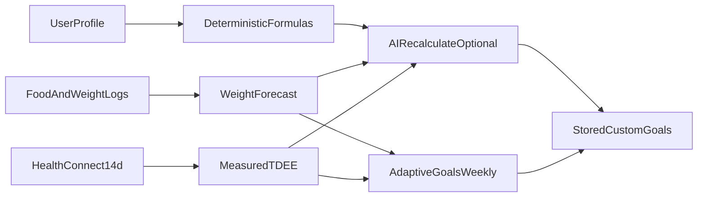

# Chompass Calculation Methods: Formula Register & Audit

Canonical reference for nutrition and sports-science math in Chompass. In-app copy lives under **Settings → Calculation Methods**; this document is the maintainer audit trail.

**Last audited:** 2026-08-22

## How goals are produced



Deterministic formulas are the **reference layer**. AI recalculation and adaptive goals refine stored targets using logged data; they do not replace the documented equations below.

---

## Formula register

| ID      | Name                     | Type          | Implementation                                 | Units    |
| ------- | ------------------------ | ------------- | ---------------------------------------------- | -------- |
| BMR-MSJ | Mifflin-St Jeor BMR      | Deterministic | `UserProfile.bmr` when no body fat %           | kcal/day |
| BMR-KM  | Katch-McArdle BMR        | Deterministic | `UserProfile.bmr` when `bodyFatPercentage` set | kcal/day |
| TDEE    | Activity multiplier TDEE | Deterministic | `UserProfile.tdee`                             | kcal/day |
| ACT-EST | Estimated daily active   | Deterministic | `UserProfile.estimatedDailyActiveCalories`     | kcal/day |
| CAL-ADJ | Goal calorie adjustment  | Deterministic | `UserProfile.calorieAdjustment`                | kcal/day |
| CAL-SAFE | Auto calorie floor/ceiling | Guardrail   | `CalorieSafety.clampAuto` / `formulas.clampAutoCalories` | kcal/day |
| MACRO-P | Protein target           | Deterministic | `UserProfile.proteinGoal`                      | g/day    |
| MACRO-F | Fat target               | Deterministic | `UserProfile.fatGoal`                          | g/day    |
| MACRO-C | Carb target              | Deterministic | `UserProfile.carbsGoal`                        | g/day    |
| KETO-C  | Keto net carbs           | Heuristic     | `KetoCarbRecommendationService`                | g/day    |
| FCAST   | Weight forecast          | Deterministic | `WeightAnalysisService.compute`                | kg/week  |
| ADAPT   | Adaptive calorie tweak   | Heuristic     | `AdaptiveGoalService.apply`                    | kcal/day |
| USNAVY  | US Navy body fat %       | Deterministic | `BodyMeasurement.usNavyBodyFatPercent`         | %        |
| WHR     | Waist-to-hip             | Deterministic | `BodyMeasurement.waistToHipRatio`              | ratio    |
| WTH     | Waist-to-height          | Deterministic | `BodyMeasurement.waistToHeightRatio`           | ratio    |
| WATER-DYN-A | Dynamic gross water goal | Heuristic     | `WaterGoalCalculator.grossGoalMl`              | ml/day   |
| WATER-DYN-B | Food-water subtraction   | Heuristic     | `WaterGoalCalculator.foodWaterMl` / `netGoalMl` | ml/day  |
| WATER-DYN-C | Adaptive reminder interval | Heuristic   | `WaterGoalCalculator.liveIntervalMin`          | min      |
| MACRO-CYCLE-A | Day-type resolution      | Deterministic | `MacroPlanResolver.resolve` / `macro-plan.js resolveDay` | kcal/day, g/day |
| MACRO-CYCLE-B | Forward window average   | Deterministic | `MacroPlanResolver.averageForward` / `averageForward` | kcal/day, g/day |
| MACRO-CYCLE-C | Per-profile safety clamp | Guardrail     | `CalorieSafety.clampAuto` per profile at every write | kcal/day |
| MACRO-CYCLE-D | Journaled target average | Deterministic | `MacroPlanResolver.journalAverage` / `journalAverage` | kcal/day, g/day |
| DTP-ACT | Per-type typical active burn | Deterministic | `DayTypeActiveStats.compute` / `day-type-active.js` | kcal/day |
| NIGHT-BAL | Nightly energy-balance band | Display     | `DailySummaryPolicy.evaluate`                  | kcal     |

### BMR-MSJ: Mifflin-St Jeor

**When:** No body fat % on profile.

```
Men:   BMR = 10×weight(kg) + 6.25×height(cm) − 5×age + 5
Women: BMR = 10×weight(kg) + 6.25×height(cm) − 5×age − 161
Other: same as women (no +5 sex term)
```

**Code:** `UserProfile.kt`: implemented as `base = … − 161`, then `+166` for male (+5 net).

**Call sites:** TDEE, adaptive safety floor, AI recalc context.

### BMR-KM: Katch-McArdle

**When:** `bodyFatPercentage` is set (fraction 0–1) and `useBodyFatInBMR` is not false (default on).

```
LBM(kg) = weight(kg) × (1 − bodyFat%)
BMR = 370 + 21.6 × LBM(kg)
```

**Call sites:** Same as BMR-MSJ. `goalBodyFatPercentage` is display-only and **not** used here.

### TDEE: Activity multiplier

```
TDEE = BMR × PAL multiplier
```

| Level        | Multiplier |
| ------------ | ---------- |
| Sedentary    | 1.2        |
| Light        | 1.375      |
| Moderate     | 1.465      |
| Active       | 1.55       |
| Very Active  | 1.725      |
| Extra Active | 1.9        |

**Note:** Moderate uses **1.465** (between common “light” and “moderate” PAL tables). Documented intentionally; finer gradation for desk-active users.

**Call sites:** `dailyCalories`, forecasts (when measured burn unavailable), adaptive ceiling basis.

### ACT-EST: Estimated daily active burn

```
estimatedDailyActive = round(TDEE − BMR)
sedentaryBudget = effectiveCalories − estimatedDailyActive
```

**When:** Home calorie gauge modes (Add Active, Dual) when **no live measured-energy source exists** (Health Connect energy permission not granted, or HC off). With a live source, measured-so-far wins even at 0: a morning before the first wearable sync shows the sedentary budget plus 0, and the estimate is never substituted for today's measured value.

**Call sites:** `UserProfile.estimatedDailyActiveCalories`, `HomeCalorieDisplay.resolveActiveBurn`, home ring + widgets, nightly summary fallback.

### NIGHT-BAL: Nightly energy-balance band (display)

Notification-only. Does not change stored goals or the Home ring.

```
burned = HC total energy if > 0
       else BMR + active
active = measured if a live HC/debug source exists (0 counts)
       else PAL estimate when no live source exists
delta  = burned − eaten
on target when |delta| ≤ 100 kcal
```

Skip the notification when no food is logged. If nothing resolvable for `burned`, keep the static summary copy.

The expanded notification also shows eaten vs the Home calorie goal (display only) and, in keto diet mode, net carbs (`carbs − fiber`, not below 0) instead of total C.

**Call sites:** `DailySummaryPolicy` (Daily summary notification).

### Home calorie gauge modes

| Mode       | HC off                              | HC on                                     |
| ---------- | ----------------------------------- | ----------------------------------------- |
| Static     | Fixed `effectiveCalories` goal      | Same                                      |
| Add Active | Sedentary budget + estimated active | Sedentary budget + measured active        |
| Net        | Falls back to Static                | Net intake (eaten − active) vs fixed goal |
| Dual       | Burn hint arc uses estimated active | Burn hint arc uses measured active        |

Add Active decomposes the stored goal so activity is not double-counted: the sedentary budget strips the PAL estimate before today's active layer is applied. With Add Active, set **Activity Level** to everyday non-training life (not peak training days); measured Health Connect burn (or the PAL estimate when HC is off) covers workouts so they are not stacked on a high PAL. With a live Health Connect source the measured value is used as-is for the whole day, morning zeros included, so the estimate is never mixed into a measured day.

When **Energy Burn Goals** is on, the stored goal is the _measured_ Health Connect TDEE (basal + active), so the PAL strip would double-subtract activity. In that case the sedentary budget uses the **measured active average** (`HealthEnergySummary.activeAverageCalories`, persisted as `healthEnergyMeasuredActiveCalories`) instead of the PAL estimate: `sedentaryBudget = effectiveCalories − measuredActiveAverage`, and the ADD_ACTIVE goal converges back to `effectiveCalories` on a typical day. The measured override applies to the home ring and widgets (`HomeUiState.gaugeBaseCalorieGoal`, `WidgetSnapshotWriter`); the shared `chompass-core` formula is unchanged (PWA has no Health Connect).

### CAL-ADJ: Goal calorie adjustment

```
adjustment = weeklyChangeKg × 7,700 / 7   (signed: negative for lose, positive for gain)
rawDailyCalories = int(TDEE) + adjustment
dailyCalories = CAL-SAFE clamp of rawDailyCalories
```

**Constant:** `NutritionConstants.KCAL_PER_KG_BODY_MASS = 7700` (shared with forecast/adaptive).

**Default pace:** 0.5 kg/week when `weeklyChangeKg` unset.

### CAL-SAFE: Auto calorie floor / ceiling

Applied to **formula** `dailyCalories` (and later Recalculate / Adaptive auto writes). Manual `customCalories` pins are not clamped here.

```
floor    = max(round(BMR), 1,200)
ceiling  = max(floor, 6,000, round(TDEE × 1.5))
dailyCalories = clamp(rawDailyCalories, floor, ceiling)
```

Stops Lose + Fast from persisting TDEE − 1,100 when that is below BMR (or below 1,200 when BMR is lower). Pace label is unchanged; the effective deficit shrinks to the floor.

### MACRO-P: Protein

```
base g/kg by activity: 0.8, 1.2, 1.6, 1.8, 2.0, 2.2
+ 0.2 g/kg when goal = LOSE (lean-mass preservation)
Standard protein is g/kg of **total** weight (the lean-mass fraction algebra cancels). Keto floor `1.6 g/kg` uses lean mass when BF% is set.
```

**User pin modes** (`ProteinTargetMode`): grams/day (`customProtein`), or g/kg of total weight / lean mass (`proteinGramsPerKg`). Rate modes recompute g/day when weight or BF% changes.

**Keto floor:** `max(standard, 1.6 × proteinBasisWeight, 60 g)`.

**Evidence:** Morton et al. 2018; Helms et al. 2014 (cutting boost).

### MACRO-F: Fat

**Standard:** `0.6 × weight(kg)` g/day.

**Keto:** Fill remaining calories after carbs and protein; floor `max(standard, 45 g)`.

### MACRO-C: Carbs

**Standard:** `(dailyCalories − protein×4 − fat×9) / 4`, floored at 0.

**Keto:** Adaptive or manual net carbs (`KetoCarbRecommendationService`), clamped 20–50 g.

### KETO-C: Net carb heuristic

| Signal                          | Adjustment          |
| ------------------------------- | ------------------- |
| Lose / Maintain / Gain baseline | 25 / 30 / 40 g      |
| Activity offset                 | −2 to +8 g by level |
| Aggressive loss (≥0.75 kg/wk)   | −5 g                |
| Body fat ≥ 30%                  | −3 g                |
| Final                           | clamp 20–50 g       |

**Policy:** Conservative ketogenic range; not personalized to ketone response.

### FCAST: Weight forecast

**Window:** Up to 90 days of food + weight entries. Intake uses **complete days only** (today excluded). `calendarDaysInWindow` runs from the **first logged food in the lookback through yesterday**, not from 90 days ago — empty days before the user started logging do not count as sparse.

```
When loggedDays / calendarDays >= 0.5:
  avgDailyCalories = sum(calories) / loggedDays
Else (sparse logging):
  avgDailyCalories = sum(calories) / calendarDaysInWindow
loggedDayAvgCalories = sum(calories) / loggedDays   // always; coach + AI empirical TDEE use this
predictedWeeklyChangeKg = (avgDailyCalories − TDEE) × 7 / 7700
observedWeeklyChangeKg = theilSenSlope(kg/day) × 7
```

**Goal ETA:** Only when moving toward goal with non-zero predicted trend.

**Trend disagreement:** `|predicted − observed| > 0.3` kg/week.

**Sparse logging:** Calendar-day averaging prevents cheat-day-only logs from inflating intake, after logging has started. Progress Avg uses the same complete-day rule (today excluded from the mean; today's bar still draws).

### Progress chart: 7-day weight trend (display-only)

**Not used by FCAST/ADAPT.** Trailing calendar-day moving average overlaid on Progress weight charts.

```
dailyKg[day] = mean(weigh-ins on that local calendar day)
trend[day] = mean(dailyKg in [day−6, day] that exist)
emit trend[day] only when ≥2 weigh-in days fall in that window
```

Shared goldens: `testdata/parity/weight-trend-expected.json`.

### ADAPT: Adaptive goals (weekly)

**Data gates:** ≥4 logged food days AND ≥6 weigh-ins spanning ≥28 days in the window, **or** measured Health Connect TDEE. Fewer weeks of scale data is treated as noise: no calorie nudge.

```
rawAdjustment = (targetWeeklyChange − observedWeeklyChange) × 7700 / 7
clamped to ±150 kcal/day; ignored if |adjustment| < 25
safetyFloor = max(BMR, 1200)
safetyCeiling = max(floor, maintenanceTdee × 1.25)
If currentCalories < safetyFloor, raise to the floor immediately (even without trend data).
```

**Measured TDEE:** 14-day Health Connect active + basal average when Energy Burn enabled.

**Locked calories:** if `caloriesLocked`, Adaptive skips the calorie write (including the sub-floor lift). Locked macros stay put when an unlocked calorie target is nudged (`applyCaloriesEdit`).

**Day types (MACRO-CYCLE):** when a macro day plan is enabled, the baseline the tweak runs against is `AdaptiveGoalService.planCurrentCalories`: the journaled lookback average (MACRO-CYCLE-D over the last 14 days, used once ≥7 days of that window are journaled — what the user actually targeted, which is what the observed trend tests) or the forward window average (MACRO-CYCLE-B) before that. The signed adjustment then applies to EVERY day-type profile (spread preserved, MACRO-CYCLE-C clamps per profile) and the base target moves by the same delta; `updatedCalories` reports the new forward weekly average.

### AI-RECALC: AI goal recalculation (two tiers, per-dispatch selection)

`FoodAnalysisService.calculateGoals` asks the AI for a full plan. The AI may replace the formula TDEE with a **hit-and-trial** maintenance estimate (logged intake minus the observed weight trend). The prompt is built TWICE and the tier follows the model that actually runs, picked per dispatch at the moment of the call:

| | SAFE (on-device models) | SMART (cloud models) |
|---|---|---|
| Observed data in prompt | Aggregates only (avg intake, Theil-Sen slope, count/span) | Raw weigh-in series (date + kg, capped ~20) + last-14-days intake table + aggregates |
| App's implied-maintenance line | Withheld when thin / below BMR / disagreeing | Always shown, labeled "the app's rough estimate — verify against the raw series" |
| Reliability judgment | App-side confidence gates (below) | Model-side, with explicit noise guidance in the prompt |
| Enforcement after parse | Deterministic snap to formula/measured anchor when data not trustworthy; pace-miss snap | None beyond the CAL-SAFE clamp + parser ranges |
| Result report | tier/provider/model recorded; fallback (incl. which provider failed) recorded when one fired | same |

**Tier rule (per dispatch, by provider AND model):** on-device → SAFE; cloud models whose id matches a small-model pattern (`flash-lite`, `nano`, `haiku`, trailing `-mini`, OpenRouter `/free`) → SAFE; everything else → SMART. Measured on-device 2026-08-22: gemini-3.5-flash-lite with the SMART prompt clamped 6/19 scenarios to the BMR floor (sparse_up 1728 vs formula 1980) and ignored the measured anchor — the exact failure the SAFE tier fixes — while gemini-3.6-flash passed all 19 (formula anchors, measured 1950, gain 3080, keto/locked exact). Unit tests: `GoalTierSelectionTest` (incl. the small-model rule and the "mini-" substring trap); harness: `goal_matrix_model` extra.

A cloud-primary → on-device-fallback call still hands the on-device leg the SAFE prompt (proven by `GoalTierSelectionTest` and the harness's forced-fallback scenario). The result sheet (Settings → Goals → Recalculate) shows which tier/provider answered, the formula baseline, the data used, and the model's full reason.

**SAFE-tier confidence gates** (these apply only to the SAFE prompt/enforcement):

```
usable      = weigh-ins >= 4 AND span >= 14 days AND logged food days >= 4
medium      = usable AND (weigh-ins < 6 OR span < 28 days OR food days < 10)
belowFloor  = implied maintenance < max(round(BMR), 1,200)
trustEmpir  = usable AND NOT belowFloor AND NOT trendsDisagree
```

- **Thin data** (not usable): the implied-maintenance number is withheld from the prompt and the model is told to anchor on the formula TDEE (or measured maintenance when Energy Burn is on).
- **Medium confidence:** implied maintenance is shown with a rule that a >15% deviation from formula TDEE goes back to the formula.
- **Below the CAL-SAFE floor:** the implied number is withheld entirely (it was dragging goals down to ~BMR).
- **Disagreeing trends** (`|predicted − observed| > 0.3` kg/week): implied maintenance is not used.

**Deterministic enforcement** (SAFE tier only — the AI prompt is advisory on small on-device models; SMART gets no snap):

```
if NOT trustEmpir:  calories = measured maintenance + goal pace, else formula dailyCalories
                    (macros reset to formula; reason rewritten)
if trustEmpir AND |model − (implied + pace)| > 150 AND |model − implied| <= 150:
                    calories = implied + goal pace   // model returned maintenance alone
```

Rationale: with sparse weigh-ins the on-device model anchored the target at ~BMR (e.g. 1742 kcal vs formula TDEE ~2680), and CAL-SAFE passes it (it is ≥ BMR), so the guard is prompt-side plus this deterministic snap. SMART shows the raw series even when thin and trusts the model's judgment (cloud matrix validation; revisit if the cloud matrix shows the same failure patterns). Unit tests: `GoalPromptGateTest` (SAFE prompt contract via the delegate) + `GoalTierSelectionTest` (per-dispatch tier selection incl. fallback); device matrix: `run_goal_matrix_test` debug extra (docs/ON_DEVICE_LLM.md).

**Day types (MACRO-CYCLE):** when a macro day plan is enabled, both prompt tiers carry a DAY TYPES block (profile list with current targets, today's active profile, the schedule, the weekly average) and the response schema gains an optional `profiles[]` array (`id`, `calories`, `protein_g`, `carbs_g`, `fat_g`; top-level numbers act as the today/average anchor). Rows are clamped per profile at parse and again at apply (`UserProfile.applyingAiGoalsToPlan`); ids that do not match the plan are ignored. When the model returns no array, or the deterministic snaps above fire (the snapped result clears it), every profile shifts by the same kcal delta the base change implies, macros re-balanced per profile (`MacroDayProfile.shiftedBy`). Locked base calories skip the plan application entirely. Unit tests: `GoalPlanRecalcTest`.

### MACRO-CYCLE: day types (#60)

Opt-in macro day plans (Settings → Goals & Nutrition → Day types): 2 to 7 named day-type profiles with explicit absolute targets, assigned by manual toggle, weekday map, or repeating cycle. Keto mode pauses the plan (data kept). Mirror implementations: `models/MacroPlanResolver.kt` (Android) and `web/app/src/lib/chompass-core/macro-plan.js` (PWA), gated by shared goldens in `testdata/parity/macro-plan-expected.json`.

#### MACRO-CYCLE-A: Day-type resolution

```
resolve(date) = assignment[date]                     // manual per-day override, any mode
             ?? mode(date)                            // MANUAL: default
                                                       // WEEKDAYS: weekday map, missing -> default
                                                       // CYCLE: pattern[floorMod(epochDay(date) − epochDay(anchor), pattern.size)]
             ?? defaultProfile
             ?? base targets (effectiveCalories / effective* macros)
```

Epoch-day integer arithmetic only (no datetime library, no zones): every device resolves a date identically, which is what the shared goldens assert.

#### MACRO-CYCLE-B: Forward window average (planning)

```
averageForward(today) = mean(resolve(today .. today + window − 1))
window = cycle pattern length (CYCLE), else 7 days
```

Already-planned per-day overrides inside the window count (that is what the user will actually eat). Used by AI Recalculate, Adaptive (before journal coverage), Coach "this week", and the widget/notification planning numbers.

#### MACRO-CYCLE-C: Per-profile safety clamp

```
profileCalories = clampAuto(raw, BMR, TDEE)   // same floor/ceiling as CAL-SAFE
macros re-balanced to the new calorie total (kcal-share distribution, fat absorbs the remainder)
```

Enforced at every write: the Settings editor, seeds, AI Recalculate rows and delta fallback, and the Adaptive spread alike. Averaging rule: since every profile ≥ floor, any average of profiles is ≥ floor too.

#### MACRO-CYCLE-D: Journaled target average (analysis)

```
journalAverage(from, to) = mean(journaled entries in [from, to])   // gaps skipped, never filled
```

The goal journal freezes each day's resolved targets as they happen (past immutable, today live, future never journaled; gap-fill from the current plan is marked GAP_FILL). Progress range lines, goal pace, the Adaptive lookback, and diary export read journaled actuals; only gaps and future days resolve live. Skipping gaps (rather than filling them) keeps today's schedule from being smuggled into history.

#### DTP-ACT: Per-type typical active burn

```
window = last 28 calendar days including today
dayTotal(date) = HC active(date) + sum(manual active on date)
group days by GoalJournalEntry.profileId (null / missing journal excluded)
typical(type) = round(mean(dayTotal)) if n ≥ 3 else unset
activeBurnTypical = typical(viewed day's type) ?: 14-day blended measured ?: PAL estimate
```

Derived only (not stored on `MacroDayProfile`, not synced). Adaptive's weekly delta stays uniform. Goldens: `testdata/parity/day-type-active-expected.json`.

### WATER-DYN-A: Dynamic gross water goal

**Android-only** (opt-in, `waterDynamicEnabled`; PWA has no water UI, so no `chompass-core` mirror yet).

**Temperature input sources (since 2026-08-13):** `expectedHighC` resolves through
`WeatherRepository` from the selected source: the manual °C wheel (default +
universal fallback) or an Open-Meteo city forecast (cache valid while its date
is today). Formula and factors are identical for every source; see
[`docs/WEATHER_INTEGRATION_DESIGN.md`](WEATHER_INTEGRATION_DESIGN.md).
(Weather-app broadcast input is parked.)

```
baseMl     = round50(weightKg × 35)            // fallback: stored manual goal when no profile weight
                                               //   (weight source selected but weightKg missing)
tempFactor = 1 + 0.04 × max(0, Tmax°C − 25)    // clamp [1.0, 1.6]
actFactor  = 1.0 / 1.1 / 1.2 / 1.3 / 1.4 / 1.5 // SEDENTARY…EXTRA_ACTIVE (profile ActivityLevel)
grossMl    = round50(baseMl × tempFactor × actFactor)
```

**Evidence / rationale:**
- **Base 35 ml/kg** sits mid-way through the commonly cited clinical range **30–40 ml/kg/day**. For a 60–80 kg adult that yields 2.1–2.8 L/day total water, between the **EFSA 2010** adequate intakes (**2.0 L/day women, 2.5 L/day men**, P95 3.1/4.0) and the **IOM 2004 / NASEM DRI** total-water AIs (**2.7 L women, 3.7 L men**). Both agencies define these AIs only for *temperate climates and low-to-moderate activity* (EFSA: “moderate environmental temperature and moderate physical activity levels (PAL 1.6)”; IOM: “healthy, sedentary people in temperate climates”). The multipliers below exist precisely because the base AI does not cover heat or activity.
- **Temperature +4 %/°C above 25 °C, capped +60 %** is a conservative heuristic (no published single constant exists). It produces ≈ +0.5 L at 30 °C and ≈ +1.0 L at 35 °C on a 2.45 L base, matching the magnitude of extra sweat/insensible loss on hot days and the “drink more on hot days” guidance (CDC Heat & Health). Exercise sweat literature (ACSM 2007) reports 0.5–2.0 L/h; resting losses rise with ambient temperature, and the factor never reduces the goal below the base.
- **Activity table 1.0–1.5** adds 0–50 % (≈ 0–1.2 L on a 2.45 L base). ACSM 2007 Position Stand: exercise sweat rates ≈ 0.5–2.0 L/h, with recommended intake ≈ 0.4–0.8 L/h during activity; trained individuals sweat substantially more than sedentary (one study: +123–144 %). The table is a monotone heuristic aligned to the profile’s existing `ActivityLevel` (TDEE multipliers 1.2–1.9 are BMR-relative and not reused here).

**Call sites:** `WaterGoalCalculator.dailyNetGoalMl` / `breakdown`: Home ring, widget snapshot, Settings preview, `WaterReminderPlanner`.

### WATER-DYN-B: Food-water subtraction (optional, coarse)

```
foodWaterMl = min(round50(foodGramsToday × 0.6), 1000)   // foodGramsToday = Σ serving grams × quantity
netGoalMl   = max(grossMl − foodWaterMl, 1000)            // never below 1 L
```

**Evidence / rationale:** food moisture is **19–30 % of total water intake** (IOM 2004, 19 % from NHANES III; EFSA 2010 assumption 20–30 %). A mixed diet is roughly **55–75 % water by mass** (fruit/vegetables 80–95 %, meat 60–70 %, cooked grains ≈ 70 %, bread ≈ 35 %), so **60 % of diary grams** is a defensible midpoint. The **1 L cap** matches the food-moisture contribution to the agency AIs (2.5 L × 20–30 % ≈ 0.5–0.75 L; 3.7 L × 19 % ≈ 0.7 L). Opt-in and coarse by design (diary grams are estimated from serving size × quantity; entries without a serving weight contribute 0).

**Call sites:** same as WATER-DYN-A when `waterFoodWaterEnabled`.

### WATER-DYN-C: Adaptive reminder interval (reporter's formula)

```
cupsRemaining   = ceil(max(netGoalMl − drunkTodayMl, 0) ÷ cupSizeMl)
windowRemaining = awakeEnd − max(now, awakeStart), minutes
intervalMin     = clamp(round5(windowRemaining ÷ cupsRemaining), 30, 240)
```

Planning form (Settings preview): `intervalMin = clamp(round5(window ÷ ceil(netGoal ÷ cup)), 30, 240)`. Equals the live form at day start. Recalculated after **every entry** (`WaterRepository.onEntriesChanged` → `WaterReminderPlanner.rearm`); goal met or window elapsed → re-arm for tomorrow's `awakeStart`.

Next-drink quantity (shown in the Home water row and the reminder notification):

```
drinkMl = min(cupSizeMl, max(netGoalMl − drunkTodayMl, 0))
```

One cup per reminder, capped by the goal remainder; a next-day fire starts fresh (`drunkTodayMl = 0`), so its amount is the first cup of the new day (the whole goal when the goal is smaller than the cup).

**Evidence / rationale:** even distribution of the remaining goal over the remaining awake window (reporter's worked example: 2,500 ml ÷ 300 ml cup over 13 h → ≈ every 90 min). Behavioral pacing heuristic (“drink regularly throughout the day rather than waiting until thirsty”, CDC Heat & Health); 30–240 min clamps guard degenerate cadences. No clinical prescription claim.

**Call sites:** `WaterReminderPlanner`, reminder-plan sheet preview, Home water row (`HomeUiState.waterNextPlan`), water notification text.

### Body composition (tape measures)

**US Navy (metric coefficients):**

```
Male:   %BF = 495 / (1.0324 − 0.19077×log10(waist−neck) + 0.15456×log10(height)) − 450
Female: %BF = 495 / (1.29579 − 0.35004×log10(waist+hips−neck) + 0.22100×log10(height)) − 450
```

Rejected if result ∉ [2, 65]% or log domain invalid.

**Wrist frame:** height / wrist ratio with gender-specific cutoffs.

---

## Scientific review: policy decisions

| Item                             | Decision                        | Rationale                                                                 |
| -------------------------------- | ------------------------------- | ------------------------------------------------------------------------- |
| Mifflin-St Jeor                  | **Keep**                        | Well-validated population BMR; ±10% typical error acknowledged in UI      |
| Katch-McArdle when BF% known     | **Keep**                        | Better for non-average composition; requires accurate BF input            |
| PAL multipliers                  | **Keep** (incl. 1.465 moderate) | FAO/WHO-aligned set; moderate tier is app-specific gradation              |
| 7,700 kcal/kg unified            | **Keep / fixed**                | Was 7,000 in goal math only; unified to 7,700 to match docs & forecast    |
| Protein 0.8–2.2 g/kg + cut boost | **Keep**                        | Matches ISSN/sports nutrition consensus                                   |
| Fat 0.6 g/kg                     | **Keep**                        | Practical minimum-fat heuristic; not a clinical prescription              |
| Keto carb heuristic              | **Keep**                        | Explicit policy range; document as heuristic not medical ketosis protocol |
| Adaptive ±150 kcal, 25 min step  | **Keep**                        | Prevents oscillation; conservative weekly nudge                           |
| Safety floor max(BMR, 1200)      | **Keep / extend to all auto writes** | Formula `dailyCalories`, Recalculate, and Adaptive; never auto-set a VLCD (800). Manual pin still allowed with confirm. |
| Linear regression on scale data  | **Replaced with Theil–Sen**     | Robust median-slope; resists outlier weigh-ins                            |
| AI goal recalculation            | **Keep, segregated**            | Non-deterministic; empirical (hit-and-trial) maintenance gated by log density (AI-RECALC below); thin/under-floor/disagreeing data falls back deterministically to formula or measured maintenance |
| US Navy BF%                      | **Keep**                        | Standard field estimate; tape measurement error propagates                |
| Water base 35 ml/kg              | **Keep**                        | Midpoint of 30–40 ml/kg clinical range; between EFSA (2.0/2.5 L) and IOM (2.7/3.7 L) totals |
| Temp factor +4 %/°C ≥ 25 °C, cap 1.6 | **Keep (heuristic)**         | AIs apply only to temperate climates; +0.5–1.0 L on hot days matches guidance |
| Water activity table 1.0–1.5     | **Keep (heuristic)**            | AIs assume sedentary/PAL 1.6; ACSM exercise sweat 0.5–2.0 L/h            |
| Food water 60 % of grams, cap 1 L | **Keep (heuristic)**           | Food moisture 19–30 % of total water intake; cap ≈ agency food-water range |
| Reminder interval 30–240 min     | **Keep**                        | Pacing heuristic; clamps prevent degenerate cadences                     |

---

## Known limitations (user-facing caveats)

1. Predictive equations carry ~±10% BMR error; TDEE error can be larger.
1b. CAL-SAFE floor max(BMR, 1,200) is a UX guardrail, not a clinical prescription. Gender OTHER uses the female Mifflin term; the floor is the mitigation for under-estimated BMR.
2. Energy balance is simplified (no metabolic adaptation model in forecast).
3. Sparse food logging uses calendar-day averaging when logged days &lt; 50% of the window from first log through yesterday.
4. Measured TDEE mixes device estimates with formula fallbacks.
5. Keto carb targets do not measure blood ketones.
6. AI meal and micronutrient estimates vary by provider and input quality.
7. Water math is a hydration **heuristic**, not a clinical prescription; it assumes healthy adults with normal kidney function. Temperature is entered manually (no location permission by design); food-water is a coarse 60 % estimate capped at 1 L.

---

## Enhancement backlog (prioritized)

| Priority | Item                                                      | Status                                                               |
| -------- | --------------------------------------------------------- | -------------------------------------------------------------------- |
| P1       | Golden scenario tests for all deterministic formulas      | **Done:** `CalculationGoldenScenariosTest`                           |
| P2       | Calendar-day intake average for forecast                  | **Done:** `WeightForecastMath.averageDailyIntake`                    |
| P2       | Document adaptive/forecast math in Calculation Methods UI | **Done:** settings strings + Calculation Methods screen              |
| P3       | Robust regression (Theil–Sen) for weight trend            | **Done:** `WeightForecastMath.theilSenSlopePerDay`                   |
| P3       | Review moderate PAL 1.465 vs literature 1.55              | **Done:** kept 1.465; documented in strings + `GoalFormulaReference` |
| P4       | AI prompt parity via shared formula reference             | **Done:** `GoalFormulaReference` + unit tests                        |
| P1       | AI recalc empirical-maintenance gate                       | **Done:** `AI-RECALC` above: SAFE/SMART tiers with per-dispatch selection (cloud → raw series + model judgment; on-device → aggregates + gates + snap); `GoalPromptGateTest` + `GoalTierSelectionTest` + Pixel 9a device matrix (`run_goal_matrix_test`) |

---

## Calculation change checklist (releases)

When changing any formula, constant, or guardrail:

1. Update implementation and `NutritionConstants` if applicable.
2. Update this file (formula register + policy table).
3. Update `strings.xml` `settings_calc_*` if user-visible.
4. Update shared golden scenarios in [`testdata/parity/formulas-expected.json`](../testdata/parity/formulas-expected.json) (Android `CalculationGoldenScenariosTest` and PWA `formulas.test.js` both read this file).
5. Mirror any change in `web/app/src/lib/chompass-core/` (`formulas.js`, `forecast.js`, `goal-formula-reference.js`).
6. If PAL / protein g/kg / `KCAL_PER_KG_BODY_MASS` change, refresh [`testdata/parity/goal-formula-prompt-fragments.json`](../testdata/parity/goal-formula-prompt-fragments.json).
7. Note change in `docs/CHANGELOG.md` with user impact (e.g. “lose goal at 0.5 kg/wk now −550 kcal vs −500”).
8. Run `devenv shell bash -lc 'cd android && ./gradlew test'` and `devenv tasks run release:check-parity` (or `./scripts/check_parity.sh`).

When changing **diary / body-metrics / meal-share / sync** wire formats: bump `format_version` / `v`, update both exporters/importers, extend [`contracts/`](../contracts/), refresh [`testdata/parity/`](../testdata/parity/) samples, then re-run `release:check-parity`. Feature imparity: [`docs/PARITY.md`](PARITY.md).

**Meal constituents (#154):** top-level meal nutrition is authoritative at parse time. Optional `constituents[]` rows are scaled or dropped by `ConstituentReconcile` / `constituents.js` (`MAX_REL_ERROR=0.50`) so grams and macros sum to the meal totals. After the user edits rows in review, constituent sums become the meal totals; whole-meal serving scale multiplies every row.

---

## Key source files

| Area                          | Path                                                                                                                                           |
| ----------------------------- | ---------------------------------------------------------------------------------------------------------------------------------------------- |
| Profile & macros              | `android/app/src/main/java/.../models/UserProfile.kt`                                                                                          |
| Home gauge math               | `android/app/src/main/java/.../models/HomeDisplayPreferences.kt`                                                                               |
| Constants                     | `android/app/src/main/java/.../models/NutritionConstants.kt`, `CalorieSafety.kt`                                                               |
| Activity / protein            | `android/app/src/main/java/.../models/ActivityLevel.kt`                                                                                        |
| Forecast & adaptive           | `android/app/src/main/java/.../services/WeightAnalysisService.kt`                                                                              |
| Forecast math (pure)          | `android/app/src/main/java/.../services/WeightForecastMath.kt`                                                                                 |
| PWA formula / forecast mirror | `web/app/src/lib/chompass-core/{formulas,forecast}.js`                                                                                         |
| Shared formula goldens        | `testdata/parity/formulas-expected.json`                                                                                                       |
| Wire-format contracts         | `contracts/*.schema.json`                                                                                                                      |
| Feature parity matrix         | `docs/PARITY.md`                                                                                                                               |
| AI formula reference          | `android/.../GoalFormulaReference.kt`, `web/.../chompass-core/goal-formula-reference.js`, `testdata/parity/goal-formula-prompt-fragments.json` |
| Keto carbs                    | `android/app/src/main/java/.../services/KetoCarbRecommendationService.kt`                                                                      |
| Body metrics                  | `android/app/src/main/java/.../models/BodyMeasurement.kt`                                                                                      |
| Water goal + reminders        | `android/.../models/WaterGoalCalculator.kt`, `android/.../services/WaterReminderPlanner.kt`                                                    |
| In-app docs                   | `SettingsScreen.kt` + `res/values/strings.xml`                                                                                                 |
| Unit tests                    | `android/app/src/test/java/.../models/` and `.../services/`                                                                                    |
