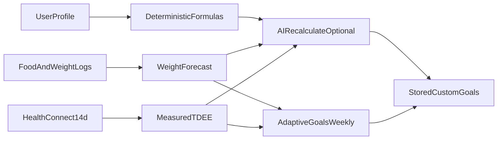

# NoFUD Calculation Methods: Formula Register & Audit

Canonical reference for nutrition and sports-science math in NoFUD. In-app copy lives under **Settings → Calculation Methods**; this document is the maintainer audit trail.

**Last audited:** 2026-07-09

## How goals are produced



Deterministic formulas are the **reference layer**. AI recalculation and adaptive goals refine stored targets using logged data; they do not replace the documented equations below.

---

## Formula register

| ID | Name | Type | Implementation | Units |
|----|------|------|----------------|-------|
| BMR-MSJ | Mifflin-St Jeor BMR | Deterministic | `UserProfile.bmr` when no body fat % | kcal/day |
| BMR-KM | Katch-McArdle BMR | Deterministic | `UserProfile.bmr` when `bodyFatPercentage` set | kcal/day |
| TDEE | Activity multiplier TDEE | Deterministic | `UserProfile.tdee` | kcal/day |
| ACT-EST | Estimated daily active | Deterministic | `UserProfile.estimatedDailyActiveCalories` | kcal/day |
| CAL-ADJ | Goal calorie adjustment | Deterministic | `UserProfile.calorieAdjustment` | kcal/day |
| MACRO-P | Protein target | Deterministic | `UserProfile.proteinGoal` | g/day |
| MACRO-F | Fat target | Deterministic | `UserProfile.fatGoal` | g/day |
| MACRO-C | Carb target | Deterministic | `UserProfile.carbsGoal` | g/day |
| KETO-C | Keto net carbs | Heuristic | `KetoCarbRecommendationService` | g/day |
| FCAST | Weight forecast | Deterministic | `WeightAnalysisService.compute` | kg/week |
| ADAPT | Adaptive calorie tweak | Heuristic | `AdaptiveGoalService.apply` | kcal/day |
| USNAVY | US Navy body fat % | Deterministic | `BodyMeasurement.usNavyBodyFatPercent` | % |
| WHR | Waist-to-hip | Deterministic | `BodyMeasurement.waistToHipRatio` | ratio |
| WTH | Waist-to-height | Deterministic | `BodyMeasurement.waistToHeightRatio` | ratio |

### BMR-MSJ: Mifflin-St Jeor

**When:** No body fat % on profile.

```
Men:   BMR = 10×weight(kg) + 6.25×height(cm) − 5×age + 5
Women: BMR = 10×weight(kg) + 6.25×height(cm) − 5×age − 161
Other: same as women (no +5 sex term)
```

**Code:** `UserProfile.kt`: implemented as `base = … − 161`, then `+166` for male (+5 net).

**Call sites:** TDEE, adaptive safety floor, AI recalc context.

### BMR-KM: Katch-McArdle

**When:** `bodyFatPercentage` is set (fraction 0–1).

```
LBM(kg) = weight(kg) × (1 − bodyFat%)
BMR = 370 + 21.6 × LBM(kg)
```

**Call sites:** Same as BMR-MSJ. `goalBodyFatPercentage` is display-only and **not** used here.

### TDEE: Activity multiplier

```
TDEE = BMR × PAL multiplier
```

| Level | Multiplier |
|-------|------------|
| Sedentary | 1.2 |
| Light | 1.375 |
| Moderate | 1.465 |
| Active | 1.55 |
| Very Active | 1.725 |
| Extra Active | 1.9 |

**Note:** Moderate uses **1.465** (between common “light” and “moderate” PAL tables). Documented intentionally; finer gradation for desk-active users.

**Call sites:** `dailyCalories`, forecasts (when measured burn unavailable), adaptive ceiling basis.

### ACT-EST: Estimated daily active burn

```
estimatedDailyActive = round(TDEE − BMR)
sedentaryBudget = effectiveCalories − estimatedDailyActive
```

**When:** Home calorie gauge modes (Add Active, Dual) when Health Connect active burn is unavailable. The PAL multiplier portion of TDEE is surfaced as today's estimated active layer.

**Call sites:** `UserProfile.estimatedDailyActiveCalories`, `HomeCalorieDisplay.resolveActiveBurn`, home ring + widgets.

### Home calorie gauge modes

| Mode | HC off | HC on |
|------|--------|-------|
| Static | Fixed `effectiveCalories` goal | Same |
| Add Active | Sedentary budget + estimated active | Sedentary budget + measured active |
| Net | Falls back to Static | Net intake (eaten − active) vs fixed goal |
| Dual | Burn hint arc uses estimated active | Burn hint arc uses measured active |

Add Active decomposes the stored goal so activity is not double-counted: the sedentary budget strips the PAL estimate before today's active layer is applied.

### CAL-ADJ: Goal calorie adjustment

```
adjustment = weeklyChangeKg × 7,700 / 7   (signed: negative for lose, positive for gain)
dailyCalories = int(TDEE) + adjustment
```

**Constant:** `NutritionConstants.KCAL_PER_KG_BODY_MASS = 7700` (shared with forecast/adaptive).

**Default pace:** 0.5 kg/week when `weeklyChangeKg` unset.

### MACRO-P: Protein

```
base g/kg by activity: 0.8, 1.2, 1.6, 1.8, 2.0, 2.2
+ 0.2 g/kg when goal = LOSE (lean-mass preservation)
If body fat % set: requirement is expressed per kg total weight via lean-mass fraction adjustment
```

**Keto floor:** `max(standard, 1.6 × proteinBasisWeight, 60 g)`.

**Evidence:** Morton et al. 2018; Helms et al. 2014 (cutting boost).

### MACRO-F: Fat

**Standard:** `0.6 × weight(kg)` g/day.

**Keto:** Fill remaining calories after carbs and protein; floor `max(standard, 45 g)`.

### MACRO-C: Carbs

**Standard:** `(dailyCalories − protein×4 − fat×9) / 4`, floored at 0.

**Keto:** Adaptive or manual net carbs (`KetoCarbRecommendationService`), clamped 20–50 g.

### KETO-C: Net carb heuristic

| Signal | Adjustment |
|--------|------------|
| Lose / Maintain / Gain baseline | 25 / 30 / 40 g |
| Activity offset | −2 to +8 g by level |
| Aggressive loss (≥0.75 kg/wk) | −5 g |
| Body fat ≥ 30% | −3 g |
| Final | clamp 20–50 g |

**Policy:** Conservative ketogenic range; not personalized to ketone response.

### FCAST: Weight forecast

**Window:** Up to 90 days of food + weight entries.

```
When loggedDays / calendarDays >= 0.5:
  avgDailyCalories = sum(calories) / loggedDays
Else (sparse logging):
  avgDailyCalories = sum(calories) / calendarDaysInWindow
predictedWeeklyChangeKg = (avgDailyCalories − TDEE) × 7 / 7700
observedWeeklyChangeKg = theilSenSlope(kg/day) × 7
```

**Goal ETA:** Only when moving toward goal with non-zero predicted trend.

**Trend disagreement:** `|predicted − observed| > 0.3` kg/week.

**Sparse logging:** Calendar-day averaging prevents cheat-day-only logs from inflating intake.

### ADAPT: Adaptive goals (weekly)

**Data gates:** ≥4 logged food days AND ≥3 weight entries in window, **or** measured Health Connect TDEE.

```
rawAdjustment = (targetWeeklyChange − observedWeeklyChange) × 7700 / 7
clamped to ±150 kcal/day; ignored if |adjustment| < 25
safetyFloor = max(BMR, 1200)
safetyCeiling = max(floor, maintenanceTdee × 1.25)
```

**Measured TDEE:** 14-day Health Connect active + basal average when Energy Burn enabled.

### Body composition (tape measures)

**US Navy (metric coefficients):**

```
Male:   %BF = 495 / (1.0324 − 0.19077×log10(waist−neck) + 0.15456×log10(height)) − 450
Female: %BF = 495 / (1.29579 − 0.35004×log10(waist+hips−neck) + 0.22100×log10(height)) − 450
```

Rejected if result ∉ [2, 65]% or log domain invalid.

**Wrist frame:** height / wrist ratio with gender-specific cutoffs.

---

## Scientific review: policy decisions

| Item | Decision | Rationale |
|------|----------|-----------|
| Mifflin-St Jeor | **Keep** | Well-validated population BMR; ±10% typical error acknowledged in UI |
| Katch-McArdle when BF% known | **Keep** | Better for non-average composition; requires accurate BF input |
| PAL multipliers | **Keep** (incl. 1.465 moderate) | FAO/WHO-aligned set; moderate tier is app-specific gradation |
| 7,700 kcal/kg unified | **Keep / fixed** | Was 7,000 in goal math only; unified to 7,700 to match docs & forecast |
| Protein 0.8–2.2 g/kg + cut boost | **Keep** | Matches ISSN/sports nutrition consensus |
| Fat 0.6 g/kg | **Keep** | Practical minimum-fat heuristic; not a clinical prescription |
| Keto carb heuristic | **Keep** | Explicit policy range; document as heuristic not medical ketosis protocol |
| Adaptive ±150 kcal, 25 min step | **Keep** | Prevents oscillation; conservative weekly nudge |
| Safety floor max(BMR, 1200) | **Keep** | UX guardrail; documented limitation for small users |
| Linear regression on scale data | **Replaced with Theil–Sen** | Robust median-slope; resists outlier weigh-ins |
| AI goal recalculation | **Keep, segregated** | Non-deterministic; audit deterministic layer separately |
| US Navy BF% | **Keep** | Standard field estimate; tape measurement error propagates |

---

## Known limitations (user-facing caveats)

1. Predictive equations carry ~±10% BMR error; TDEE error can be larger.
2. Energy balance is simplified (no metabolic adaptation model in forecast).
3. Sparse food logging uses calendar-day averaging when logged days &lt; 50% of window.
4. Measured TDEE mixes device estimates with formula fallbacks.
5. Keto carb targets do not measure blood ketones.
6. AI meal and micronutrient estimates vary by provider and input quality.

---

## Enhancement backlog (prioritized)

| Priority | Item | Status |
|----------|------|--------|
| P1 | Golden scenario tests for all deterministic formulas | **Done:** `CalculationGoldenScenariosTest` |
| P2 | Calendar-day intake average for forecast | **Done:** `WeightForecastMath.averageDailyIntake` |
| P2 | Document adaptive/forecast math in Calculation Methods UI | **Done:** settings strings + Calculation Methods screen |
| P3 | Robust regression (Theil–Sen) for weight trend | **Done:** `WeightForecastMath.theilSenSlopePerDay` |
| P3 | Review moderate PAL 1.465 vs literature 1.55 | **Done:** kept 1.465; documented in strings + `GoalFormulaReference` |
| P4 | AI prompt parity via shared formula reference | **Done:** `GoalFormulaReference` + unit tests |

---

## Calculation change checklist (releases)

When changing any formula, constant, or guardrail:

1. Update implementation and `NutritionConstants` if applicable.
2. Update this file (formula register + policy table).
3. Update `strings.xml` `settings_calc_*` if user-visible.
4. Update shared golden scenarios in [`testdata/parity/formulas-expected.json`](../testdata/parity/formulas-expected.json) (Android `CalculationGoldenScenariosTest` and PWA `formulas.test.js` both read this file).
5. Mirror any change in `web/app/src/lib/nofud-core/` (`formulas.js`, `forecast.js`).
6. Note change in `docs/CHANGELOG.md` with user impact (e.g. “lose goal at 0.5 kg/wk now −550 kcal vs −500”).
7. Run `devenv shell bash -lc 'cd android && ./gradlew test'` and `devenv tasks run release:check-parity` (or `./scripts/check_parity.sh`).

When changing **diary / body-metrics / meal-share** wire formats: bump `format_version` / `v`, update both exporters/importers, extend [`contracts/`](../contracts/), refresh [`testdata/parity/`](../testdata/parity/) samples, then re-run `release:check-parity`. Feature imparity: [`docs/PARITY.md`](PARITY.md).

---

## Key source files

| Area | Path |
|------|------|
| Profile & macros | `android/app/src/main/java/.../models/UserProfile.kt` |
| Home gauge math | `android/app/src/main/java/.../models/HomeDisplayPreferences.kt` |
| Constants | `android/app/src/main/java/.../models/NutritionConstants.kt` |
| Activity / protein | `android/app/src/main/java/.../models/ActivityLevel.kt` |
| Forecast & adaptive | `android/app/src/main/java/.../services/WeightAnalysisService.kt` |
| Forecast math (pure) | `android/app/src/main/java/.../services/WeightForecastMath.kt` |
| PWA formula / forecast mirror | `web/app/src/lib/nofud-core/{formulas,forecast}.js` |
| Shared formula goldens | `testdata/parity/formulas-expected.json` |
| Wire-format contracts | `contracts/*.schema.json` |
| Feature parity matrix | `docs/PARITY.md` |
| AI formula reference | `android/app/src/main/java/.../models/GoalFormulaReference.kt` |
| Keto carbs | `android/app/src/main/java/.../services/KetoCarbRecommendationService.kt` |
| Body metrics | `android/app/src/main/java/.../models/BodyMeasurement.kt` |
| In-app docs | `SettingsScreen.kt` + `res/values/strings.xml` |
| Unit tests | `android/app/src/test/java/.../models/` and `.../services/` |
