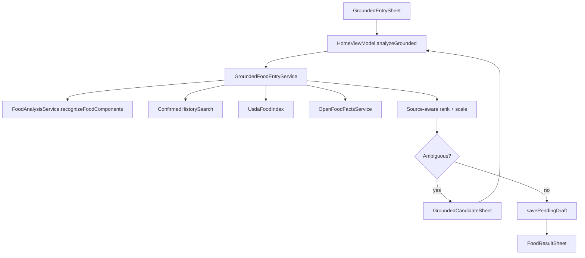

# Grounded food entry

Optional entry method that uses the selected AI provider only for **food recognition**
(identity, components, portion hints), then resolves nutrient values from local /
deterministic sources.

## Trust order

1. Exact barcode → live [Open Food Facts](https://world.openfoodfacts.org/) (cached)
2. Explicitly selected confirmed history / favorites (identity only; portion not auto-copied)
3. Compact offline USDA Foundation + FNDDS index (`assets/usda/usda_foods.sqlite`)
4. Clearly marked model estimate when no database match exists

## UX

- **Add food → Grounded**: text, photo, or photo+text
- Progress phases: Recognizing → History → USDA → Resolving
- Ambiguous matches open a candidate/portion sheet before `FoodResultSheet`
- Review sheet shows a provenance badge (USDA / OFF / history / estimate)

Existing Photo / Note / Barcode / Manual flows are unchanged.

## Offline USDA index

| Item | Path |
|------|------|
| SQLite asset | [`android/app/src/main/assets/usda/usda_foods.sqlite`](../android/app/src/main/assets/usda/usda_foods.sqlite) |
| Manifest (sha256, version) | [`android/app/src/main/assets/usda/usda_foods.manifest.json`](../android/app/src/main/assets/usda/usda_foods.manifest.json) |
| Build script | [`scripts/build_usda_food_index.py`](../scripts/build_usda_food_index.py) |

Regenerate the small committed fixture (no network):

```bash
uv run python scripts/build_usda_food_index.py --fixture
```

Build from a pinned FoodData Central CSV zip (downloads ~hundreds of MB once):

```bash
uv run python scripts/build_usda_food_index.py
# or: uv run python scripts/build_usda_food_index.py --zip-path /path/to/FoodData_Central_csv_*.zip
```

Raw downloads land in `build/usda-fdc/` (gitignored). The APK ships whatever
SQLite is currently under `assets/usda/`.

### Licensing

| Source | License | Notes |
|--------|---------|--------|
| USDA FoodData Central | CC0 / public domain | Cite USDA; safe to ship offline |
| Open Food Facts | ODbL database + DbCL contents | Live lookup only; do not merge into USDA SQLite; keep provenance separable |
| User history | Private on-device | Only confirmed diary/favorites; portion never silently reused |

## Privacy

- Recognition images/text go to the **user-selected** AI provider (same BYOK path as other entry methods), or on-device when configured
- USDA lookups are fully local
- Open Food Facts requests send only the barcode (existing barcode flow)
- History search never leaves the device

## Architecture



Key types: [`FoodGrounding.kt`](../android/app/src/main/java/org/codeberg/fitguy/nofud/models/FoodGrounding.kt),
[`GroundedFoodEntryService.kt`](../android/app/src/main/java/org/codeberg/fitguy/nofud/services/grounding/GroundedFoodEntryService.kt),
[`UsdaFoodIndex.kt`](../android/app/src/main/java/org/codeberg/fitguy/nofud/services/grounding/UsdaFoodIndex.kt).

Provider landscape research: see the nutrition grounding canvas from the design pass.

## Benchmarks

Extend the food-accuracy harness with grounded recognition+lookup later. For now:

```bash
# Asset integrity
python -c "import json,hashlib,pathlib; m=json.load(open('android/app/src/main/assets/usda/usda_foods.manifest.json')); b=pathlib.Path('android/app/src/main/assets/usda/usda_foods.sqlite').read_bytes(); assert hashlib.sha256(b).hexdigest()==m['sha256']; print(m['food_count'], 'foods ok')"
```

Suggested future metrics (vs single-shot baseline): top-k identity hit rate, source coverage, gram error, nutrient WMAPE, fallback/correction rate, latency, asset size.
