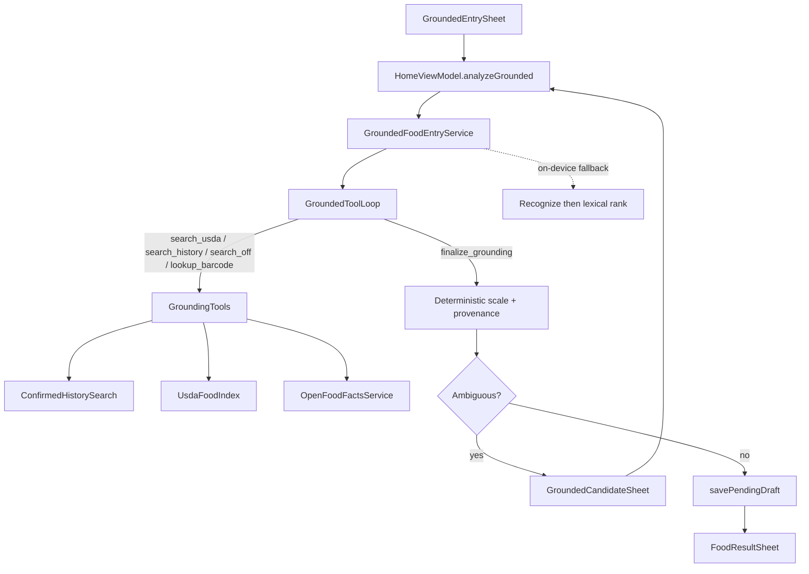

# Grounded food entry

**Status: WIP — not production, not ready to ship.**  
[`GroundedEntryFeature.ENABLED`](../android/app/src/main/java/app/chompass/services/grounding/GroundedEntryFeature.kt) stays **`false`**. Do not package USDA into release/F-Droid APKs, do not advertise the entry method, and do not flip the flag until the [readiness checklist](#readiness-checklist) is fully green. Code + harness remain in-tree for continued research.

Optional entry method that uses the selected AI provider to **search local
databases and pick identities**, then resolves nutrient values from those
sources only (never from invented macros).

## Progress so far (2026-07-29)

### Built (research / debug only)

1. **Offline USDA index** — Foundation + FNDDS SQLite (`~5.8k` foods, `~3.8 MB` with FTS), builder at [`scripts/build_usda_food_index.py`](../scripts/build_usda_food_index.py) with **FTS5**, multi-portion table, Atwater energy fill, WWEIA categories when present, omega-3 merge. Android [`UsdaFoodIndex`](../android/app/src/main/java/app/chompass/services/grounding/UsdaFoodIndex.kt). Packaged in **debug** builds only (`src/debug/assets/usda/`), not release.
2. **Provenance model** — `FoodGroundingProvenance` / `GroundingCandidate` / validation helpers; `FoodSource.GROUNDED` for diary export/import (**provenance round-trips in JSON export**).
3. **Orchestrator** — [`GroundedFoodEntryService`](../android/app/src/main/java/app/chompass/services/grounding/GroundedFoodEntryService.kt): barcode → OFF, history, USDA, then model-estimate fallback. Deterministic **scale from DB rows** (model must not invent macros). Preserves first-pass recognition on candidate review.
4. **Cloud tool loop** — [`GroundingTools`](../android/app/src/main/java/app/chompass/services/grounding/GroundingTools.kt) + [`GroundedToolLoop`](../android/app/src/main/java/app/chompass/services/ai/GroundedToolLoop.kt) (max 4 rounds): `search_usda` / `search_history` / **`search_off`** / `lookup_barcode` → `finalize_grounding`. Finalize only accepts `source_id`s seen in this run. `search_off` is live OFF product/brand search (ODbL; query string only — not diary).
5. **Retrieval ranking** — Shared [`QueryNormalizer`](../android/app/src/main/java/app/chompass/services/grounding/QueryNormalizer.kt) (Kotlin + Python); prefer FNDDS; soft-penalize flour/powder/dry/pie and beverage mismatches; calibrated source-aware scores + ambiguity margin `1.5`; local [`GroundingCorrectionStore`](../android/app/src/main/java/app/chompass/services/grounding/GroundingCorrectionStore.kt) priors. OFF search uses the same ambiguity margin for top-2 ties.
6. **Portion resolver** — [`PortionResolver`](../android/app/src/main/java/app/chompass/services/grounding/PortionResolver.kt): override → **qty×unit** (household + candidate serving + aliases) → estimated grams → candidate serving → heuristic; **never silent 100 g**. Vague units (`slice`/`piece`/size words) set `needsUserConfirmation` and open the portion sheet even when grams were guessed. Python harness mirrors this in [`portion_resolve.py`](benchmarks/food_accuracy/portion_resolve.py) (no GT-mass / 100 g fill).
7. **UI (gated)** — Add-food tile, entry sheet, candidate sheet, provenance + confidence badges — hidden while `GroundedEntryFeature.ENABLED == false`. On-device policy: `ALLOW_ON_DEVICE = false`.
8. **Harness** — [`docs/benchmarks/food_accuracy/run_grounded_eval.py`](benchmarks/food_accuracy/run_grounded_eval.py), failure-class metrics, bad-case + history/OFF manifests, retrieval golden vectors, **realistic text readiness gate** ([`eval_grounded_realistic_text.jsonl`](benchmarks/food_accuracy/manifest/eval_grounded_realistic_text.jsonl) + [`off_fixtures.json`](benchmarks/food_accuracy/manifest/off_fixtures.json)), `devenv tasks run benchmark:food-accuracy-smoke`.

### Benchmark snapshot — primary gate (realistic text-38, 2026-07-29)

**Method:** prompts omit gram masses (vague titles / household units / multi / branded). Same Flash Lite pin for grounded tool-loop vs single-shot `compact`. Branded `search_off` uses offline fixtures.

| Path | WMAPE | ±20% kcal | MAE kcal | parse | Notes |
|------|-------|-----------|----------|-------|-------|
| Single-shot Flash Lite (`quick_…_realistic_text`) | **27.3%** | **71.1%** | **49.4** | 100% | Ungrounded struggles without gram cues (esp. branded) |
| Tool-loop grounded (`grounded_…_realistic_text`) | **18.5%** | **76.3%** | **33.0** | **100%** | **Beats** same-manifest single-shot; OFF source rate 18%; silent-zero 0%; fallback 0% |

Per-slice (grounded / ungrounded WMAPE):

| Slice | n | Grounded | Ungrounded |
|-------|--:|---------:|-----------:|
| branded | 8 | **7.1%** | 120% |
| household | 12 | 14.2% | **4.3%** |
| multi | 6 | 14.3% | 14.7% |
| vague | 12 | 32.2% | **22.6%** |

**Vs readiness targets** ([`baselines/grounded_realistic_text_thresholds.json`](benchmarks/food_accuracy/baselines/grounded_realistic_text_thresholds.json)): overall grounded ahead of ungrounded ✓ · parse ✓ · silent-zero ✓ · branded OFF usage 75% ✓ · absolute WMAPE ≤22% ✓ · ±20% ≥70% ✓. Still WIP: vague portion/identity weak; photo gate not run; flag stays off.

Artifacts: `results/grounded_tool_gemini35_flash_lite_realistic_text/`, `results/quick_gemini35_flash_lite_realistic_text/` (gitignored).

### Benchmark snapshot — gram-rich identity regression (FNDDS text-42)

Gram-rich prompts (`"…, 150 g"`) favor single-shot parsing. Keep as **identity/form regression only**, not the ship gate ([`baselines/grounded_text_thresholds.json`](benchmarks/food_accuracy/baselines/grounded_text_thresholds.json)).

| Path | WMAPE | ±20% kcal | MAE kcal | parse | Notes |
|------|-------|-----------|----------|-------|-------|
| Single-shot Flash Lite (`quick_gemini35_flash_lite_text`) | **4.8%** | **92.9%** | **7.1** | 100% | Reads grams from the prompt |
| Tool-loop grounded **portion-fidelity** (`…_portion_fidelity`, 2026-07-29) | **10.1%** | **81.0%** | **16.6** | **100%** | ~2× worse than single-shot — expected on this set |

### Known gaps that keep this WIP

- Vague-slice portion/identity still weak vs single-shot on the realistic gate.
- Household units: single-shot still ahead (easy qty×density); grounded should close via USDA serving rows.
- Photo grounded eval (JFB / Nutrition5k) not run to readiness.
- On-device path is lexical only; gated off via `ALLOW_ON_DEVICE`.
- Release packaging must not run until checklist is green (`./scripts/package_usda_for_release.sh --confirm` is intentionally confirm-gated).

## Readiness checklist

Enable `GroundedEntryFeature.ENABLED` only when **all** of the following hold:

1. **Accuracy (text — primary)** — Flash Lite grounded tool-loop on [`eval_grounded_realistic_text.jsonl`](benchmarks/food_accuracy/manifest/eval_grounded_realistic_text.jsonl) meets [`grounded_realistic_text_thresholds.json`](benchmarks/food_accuracy/baselines/grounded_realistic_text_thresholds.json): not badly behind same-manifest single-shot (target: WMAPE ≤ ~22% and ≤ ~1.15× ungrounded; ±20% ≥ ~70%; parse ≥ ~95%; branded OFF source rate ≥ ~50%).
2. **Accuracy (image)** — At least one photo split (e.g. JFB / Nutrition5k subset) where grounded does not regress badly vs single-shot Photo flow; document numbers in this file.
3. **Identity** — Clear drop in form-mismatch failures (flour/powder/pie/dry vs cooked; beer vs solids) on a recorded bad-case list. Gram-rich [`eval_text.jsonl`](benchmarks/food_accuracy/manifest/eval_text.jsonl) remains an identity **regression** smoke (not the ship gate).
4. **Fallback UX** — `reject_to_estimate` / missing match always surfaces a clear estimate badge or candidate sheet; never silent 0 kcal.
5. **On-device policy** — `GroundedEntryFeature.ALLOW_ON_DEVICE == false` (grounded disabled for LiteRT) **or** ship a tested deterministic path with the same provenance rules.
6. **Strings** — Localized grounded UI strings for shipped locales (EN + DE/ES/FR done; remaining locales fall back to EN until translated).
7. **Release note** — Short CHANGELOG blurb + privacy line (BYOK recognition + local USDA/OFF/history).
8. **USDA packaging** — Run [`scripts/package_usda_for_release.sh --confirm`](../scripts/package_usda_for_release.sh) to copy `src/debug/assets/usda/` → `src/main/assets/usda/` (or ship a downloadable index) so release/F-Droid APKs include the offline DB before flipping the flag.

Until then: keep the flag **false**; treat grounded as **WIP research only**; USDA stays out of release APKs; develop via unit tests + `run_grounded_eval.py` against the debug asset.

### Local re-enable for development

```kotlin
// GroundedEntryFeature.kt — temporary, do not commit true for release
const val ENABLED: Boolean = true
```

## Trust order

1. Exact barcode → live [Open Food Facts](https://world.openfoodfacts.org/) (cached)
2. Explicitly selected confirmed history / favorites (identity only; portion not auto-copied)
3. Compact offline USDA Foundation + FNDDS index (`src/debug/assets/usda/usda_foods.sqlite` until productized)
4. Clearly marked model estimate when no database match exists

## UX (when enabled)

- **Add food → Grounded**: text, photo, or photo+text
- Progress phases: Recognizing → History → USDA → Resolving (mapped from tool rounds)
- Ambiguous matches open a candidate/portion sheet before `FoodResultSheet`
- Review sheet shows a provenance badge (USDA / OFF / history / estimate)

Existing Photo / Note / Barcode / Manual flows are unchanged.

## Cloud tool loop vs on-device

| Provider | Behavior |
|----------|----------|
| Cloud BYOK (OpenAI-compatible / Gemini / Anthropic) | Bounded tool loop (max 4 rounds): `search_usda`, `search_history`, `search_off`, `lookup_barcode`, then required `finalize_grounding`. The model chooses `source_id` / grams; the app scales nutrients from DB rows. |
| On-device LiteRT | Deterministic recognize → lexical retrieve/rank (no tool chat). Tool calling stays experimental for Coach only. |

If a cloud provider fails to tool-call or finalize, the orchestrator falls back to the deterministic path.

## Offline USDA index

| Item | Path |
|------|------|
| SQLite asset (debug APK only) | [`android/app/src/debug/assets/usda/usda_foods.sqlite`](../android/app/src/debug/assets/usda/usda_foods.sqlite) |
| Manifest (sha256, version) | [`android/app/src/debug/assets/usda/usda_foods.manifest.json`](../android/app/src/debug/assets/usda/usda_foods.manifest.json) |
| Build script | [`scripts/build_usda_food_index.py`](../scripts/build_usda_food_index.py) |

Ranking prefers **FNDDS / `survey_fndds_food`** for cooked or generic meals and soft-penalizes form mismatches (flour / powder / dry / pie vs cooked solids; wrong beverage hits). Search omits rows with null calories by default so Foundation energy gaps cannot scale as 0 kcal.

Regenerate the small committed fixture (no network):

```bash
uv run python scripts/build_usda_food_index.py --fixture
```

Build from a pinned FoodData Central CSV zip (downloads ~hundreds of MB once):

```bash
uv run python scripts/build_usda_food_index.py
# or: uv run python scripts/build_usda_food_index.py --zip-path /path/to/FoodData_Central_csv_*.zip
```

Raw downloads land in `build/usda-fdc/` (gitignored). Debug APKs ship whatever
SQLite is currently under `src/debug/assets/usda/`. Release APKs omit it until
grounded entry is productized (then move back under `src/main/assets`).

### Licensing

| Source | License | Notes |
|--------|---------|--------|
| USDA FoodData Central | CC0 / public domain | Cite USDA; safe to ship offline |
| Open Food Facts | ODbL database + DbCL contents | Live lookup only; do not merge into USDA SQLite; keep provenance separable |
| User history | Private on-device | Only confirmed diary/favorites; portion never silently reused |

## Privacy

- Recognition images/text go to the **user-selected** AI provider (same BYOK path as other entry methods), or on-device when configured
- USDA lookups are fully local
- Open Food Facts **barcode** lookups send only the barcode (existing barcode flow)
- Open Food Facts **`search_off`** sends only the search query string (brand + product name) — never diary history or images
- History search never leaves the device

## Architecture



Key types: [`FoodGrounding.kt`](../android/app/src/main/java/app/chompass/models/FoodGrounding.kt),
[`GroundedFoodEntryService.kt`](../android/app/src/main/java/app/chompass/services/grounding/GroundedFoodEntryService.kt),
[`GroundingTools.kt`](../android/app/src/main/java/app/chompass/services/grounding/GroundingTools.kt),
[`GroundedToolLoop.kt`](../android/app/src/main/java/app/chompass/services/ai/GroundedToolLoop.kt),
[`UsdaFoodIndex.kt`](../android/app/src/main/java/app/chompass/services/grounding/UsdaFoodIndex.kt),
[`GroundedEntryFeature.kt`](../android/app/src/main/java/app/chompass/services/grounding/GroundedEntryFeature.kt).

## Benchmarks

```bash
# Primary readiness gate (realistic text — no grams in prompts)
uv run python docs/benchmarks/food_accuracy/run_eval.py \
  --provider openrouter --model google/gemini-3.5-flash-lite --prompt compact \
  --manifest docs/benchmarks/food_accuracy/manifest/eval_grounded_realistic_text.jsonl \
  --out docs/benchmarks/food_accuracy/results/quick_gemini35_flash_lite_realistic_text

uv run python docs/benchmarks/food_accuracy/run_grounded_eval.py \
  --provider openrouter --model google/gemini-3.5-flash-lite \
  --manifest docs/benchmarks/food_accuracy/manifest/eval_grounded_realistic_text.jsonl \
  --off-fixtures docs/benchmarks/food_accuracy/manifest/off_fixtures.json \
  --out docs/benchmarks/food_accuracy/results/grounded_tool_gemini35_flash_lite_realistic_text \
  --sleep 4

uv run python docs/benchmarks/food_accuracy/compare_runs.py \
  docs/benchmarks/food_accuracy/results/quick_gemini35_flash_lite_realistic_text/summary.csv \
  docs/benchmarks/food_accuracy/results/grounded_tool_gemini35_flash_lite_realistic_text/summary.csv

uv run python docs/benchmarks/food_accuracy/summarize_realistic_slices.py \
  --grounded docs/benchmarks/food_accuracy/results/grounded_tool_gemini35_flash_lite_realistic_text \
  --ungrounded docs/benchmarks/food_accuracy/results/quick_gemini35_flash_lite_realistic_text

# Rebuild realistic manifest after editing builder curation lists:
uv run python docs/benchmarks/food_accuracy/build_realistic_text_manifest.py
```

Asset integrity:

```bash
uv run python -c "import json,hashlib,pathlib; m=json.load(open('android/app/src/debug/assets/usda/usda_foods.manifest.json')); b=pathlib.Path('android/app/src/debug/assets/usda/usda_foods.sqlite').read_bytes(); assert hashlib.sha256(b).hexdigest()==m['sha256']; print(m['food_count'], 'foods ok')"
```

Metrics: top-k identity hit rate, source coverage, gram error, nutrient WMAPE, tool rounds, search count, fallback/correction rate, latency, asset size.
