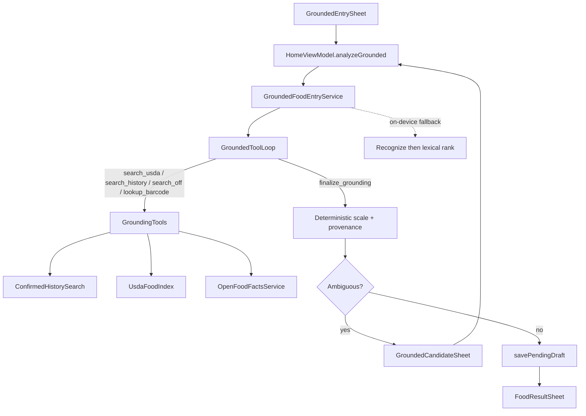

# Grounded food entry

**Status: WIP, not production, not ready to ship.**
[`GroundedEntryFeature.ENABLED`](../android/app/src/main/java/app/chompass/services/grounding/GroundedEntryFeature.kt) stays **`false`**. Do not advertise the entry method, and do not flip the flag until the [readiness checklist](#readiness-checklist) is fully green. The offline USDA index already ships for Add Food **Search food**; only the grounded *entry UI* is hidden.

Optional entry method that uses the selected AI provider to **search local
databases and pick identities**, then resolves nutrient values from those
sources only (never from invented macros).

## What is built (research / debug only)

1. **Offline USDA index**: Foundation + FNDDS SQLite (`~5.8k` foods), builder [`scripts/build_usda_food_index.py`](../scripts/build_usda_food_index.py); Android [`UsdaFoodIndex`](../android/app/src/main/java/app/chompass/services/grounding/UsdaFoodIndex.kt). Ships under `src/main/assets/usda/` for Search food ([`PARITY.md`](PARITY.md)).
2. **Provenance model**: `FoodGroundingProvenance` / `GroundingCandidate`; `FoodSource.GROUNDED` round-trips in diary JSON.
3. **Orchestrator**: [`GroundedFoodEntryService`](../android/app/src/main/java/app/chompass/services/grounding/GroundedFoodEntryService.kt): barcode → OFF, history, USDA, then model-estimate fallback. Scale from DB rows only.
4. **Cloud tool loop**: [`GroundingTools`](../android/app/src/main/java/app/chompass/services/grounding/GroundingTools.kt) + [`GroundedToolLoop`](../android/app/src/main/java/app/chompass/services/ai/GroundedToolLoop.kt) (max 4 rounds): `search_usda` / `search_history` / `search_off` / `lookup_barcode` → `finalize_grounding`.
5. **Portion resolver**: [`PortionResolver`](../android/app/src/main/java/app/chompass/services/grounding/PortionResolver.kt); never silent 100 g.
6. **UI (gated)**: hidden while `ENABLED == false`. On-device policy: `ALLOW_ON_DEVICE = false`.
7. **Harness**: [`docs/benchmarks/food_accuracy/`](benchmarks/food_accuracy/README.md) (`run_grounded_eval.py`, realistic-text gate, `devenv tasks run benchmark:food-accuracy-smoke`).

## Known gaps that keep this WIP

- Vague-slice portion/identity still weak vs single-shot on the realistic gate.
- Household units: single-shot still ahead; grounded should close via USDA serving rows.
- Photo grounded eval (JFB / Nutrition5k) not run to readiness.
- On-device path is lexical only; gated off via `ALLOW_ON_DEVICE`.

## Readiness checklist

Enable `GroundedEntryFeature.ENABLED` only when **all** of the following hold:

1. **Accuracy (text, primary)**: Flash Lite grounded tool-loop on [`eval_grounded_realistic_text.jsonl`](benchmarks/food_accuracy/manifest/eval_grounded_realistic_text.jsonl) meets [`grounded_realistic_text_thresholds.json`](benchmarks/food_accuracy/baselines/grounded_realistic_text_thresholds.json): not badly behind same-manifest single-shot (target: WMAPE ≤ ~22% and ≤ ~1.15× ungrounded; ±20% ≥ ~70%; parse ≥ ~95%; branded OFF source rate ≥ ~50%).
2. **Accuracy (image)**: At least one photo split where grounded does not regress badly vs single-shot Photo flow; document numbers here.
3. **Identity**: Clear drop in form-mismatch failures on a recorded bad-case list. Gram-rich [`eval_text.jsonl`](benchmarks/food_accuracy/manifest/eval_text.jsonl) remains an identity **regression** smoke (not the ship gate).
4. **Fallback UX**: `reject_to_estimate` / missing match always surfaces a clear estimate badge or candidate sheet; never silent 0 kcal.
5. **On-device policy**: `ALLOW_ON_DEVICE == false` **or** ship a tested deterministic path with the same provenance rules.
6. **Strings**: Localized grounded UI strings for shipped locales (EN + DE/ES/FR done; remaining locales fall back to EN).
7. **Release note**: Short CHANGELOG blurb + privacy line (BYOK recognition + local USDA/OFF/history).
8. **USDA packaging**: **Done (2026-08-04)** for Search food. Flip `ENABLED` only when the remaining items above are green.

Until then: keep the flag **false**. Do not commit `ENABLED = true`.

## Trust order

1. Exact barcode → live [Open Food Facts](https://world.openfoodfacts.org/) (cached)
2. Explicitly selected confirmed history / favorites (identity only; portion not auto-copied)
3. Compact offline USDA Foundation + FNDDS index (`src/main/assets/usda/usda_foods.sqlite`)
4. Clearly marked model estimate when no database match exists

## UX (when enabled)

- **Add food → Grounded**: text, photo, or photo+text
- Ambiguous matches open a candidate/portion sheet before `FoodResultSheet`
- Review sheet shows a provenance badge (USDA / OFF / history / estimate)

Existing Photo / Note / Barcode / Manual flows are unchanged.

## Cloud tool loop vs on-device

| Provider | Behavior |
|----------|----------|
| Cloud BYOK | Bounded tool loop (max 4 rounds), then `finalize_grounding`. The app scales nutrients from DB rows. |
| On-device LiteRT | Deterministic recognize → lexical retrieve/rank (no tool chat). |

If a cloud provider fails to tool-call or finalize, the orchestrator falls back to the deterministic path.

## Offline USDA index

| Item | Path |
|------|------|
| SQLite asset (all build types) | [`android/app/src/main/assets/usda/usda_foods.sqlite`](../android/app/src/main/assets/usda/usda_foods.sqlite) |
| Manifest (sha256, version) | [`android/app/src/main/assets/usda/usda_foods.manifest.json`](../android/app/src/main/assets/usda/usda_foods.manifest.json) |
| Build script | [`scripts/build_usda_food_index.py`](../scripts/build_usda_food_index.py) |

```bash
uv run python scripts/build_usda_food_index.py --fixture   # small committed fixture, no network
uv run python scripts/build_usda_food_index.py             # pinned FoodData Central CSV zip
```

Raw downloads land in `build/usda-fdc/` (gitignored).

| Source | License | Notes |
|--------|---------|--------|
| USDA FoodData Central | CC0 / public domain | Cite USDA; safe to ship offline |
| Open Food Facts | ODbL database + DbCL contents | Live lookup only; do not merge into USDA SQLite |
| User history | Private on-device | Only confirmed diary/favorites; portion never silently reused |

## Privacy

- Recognition images/text go to the **user-selected** AI provider (same BYOK path as other entry methods), or on-device when configured
- USDA lookups are fully local
- Open Food Facts **barcode** lookups send only the barcode
- Open Food Facts **`search_off`** sends only the search query string: never diary history or images
- History search never leaves the device

## Architecture



Key types: [`FoodGrounding.kt`](../android/app/src/main/java/app/chompass/models/FoodGrounding.kt),
[`GroundedFoodEntryService.kt`](../android/app/src/main/java/app/chompass/services/grounding/GroundedFoodEntryService.kt),
[`GroundingTools.kt`](../android/app/src/main/java/app/chompass/services/grounding/GroundingTools.kt),
[`GroundedToolLoop.kt`](../android/app/src/main/java/app/chompass/services/ai/GroundedToolLoop.kt),
[`UsdaFoodIndex.kt`](../android/app/src/main/java/app/chompass/services/grounding/UsdaFoodIndex.kt),
[`GroundedEntryFeature.kt`](../android/app/src/main/java/app/chompass/services/grounding/GroundedEntryFeature.kt).
